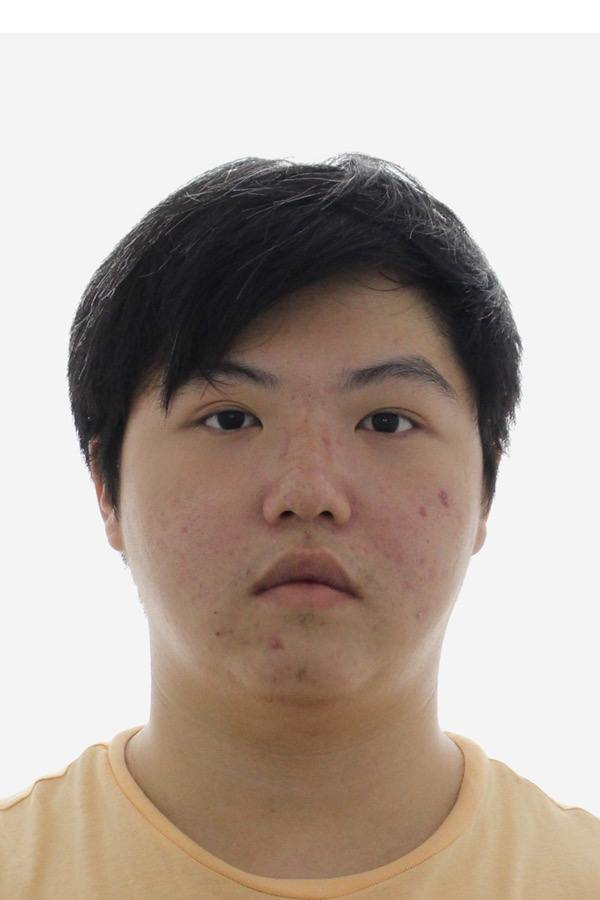
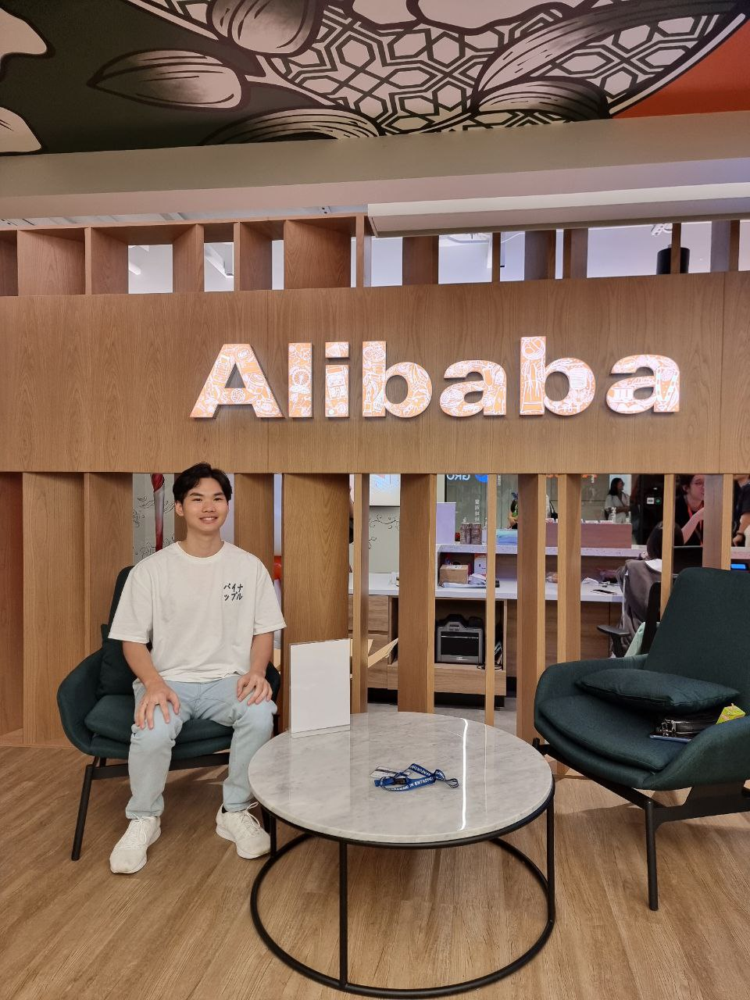
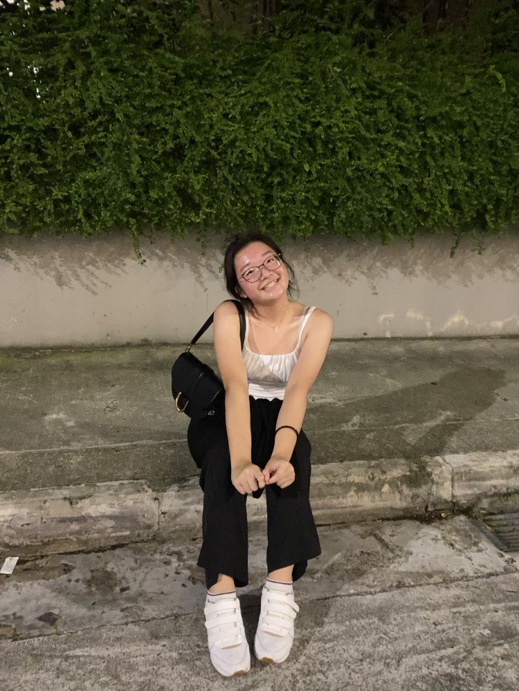

# About Us

We are a team based in the [School of Computing, National University of Singapore](http://www.comp.nus.edu.sg).

You can reach us at the email `seer[at]comp.nus.edu.sg`

## Project team

### Brendan Koh

[[homepage](https://brein62.github.io)]
[[github](https://github.com/brein62)]
[[portfolio](team/brein62.md)]

* Role: Tech/GitHub Lead

### Jordan Kang

[[github](http://github.com/jordankanghm)]
[[portfolio](team/jordankanghm.md)]

* Role: Team Member
* Responsibilities: UI

### Zacharias Wong

[[github](https://github.com/zacwong2151)] [[portfolio](team/zacwong2151.md)]

* Role: Keyboard typer
* Responsibilities: Typeracer

### Lee Ruo Xuan

[[github](http://github.com/ruo-x)]
[[portfolio](team/ruo-x.md)]

* Role: Developer
* Responsibilities: Developing

### Tiong Meng Sheng

[[github](http://github.com/tiongMax)]
[[portfolio](team/tiongmax.md)]

* Role: Developer
* Responsibilities: UI
