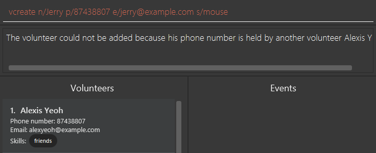

# iVolunteer Developer Guide

<!-- * Table of Contents -->
<page-nav-print />

--------------------------------------------------------------------------------------------------------------------

## **Acknowledgements**

* Libraries used: [JavaFX](https://openjfx.io/), [Jackson](https://github.com/FasterXML/jackson), [JUnit5](https://github.com/junit-team/junit5)
* This project is based on the AddressBook-Level3 project created by the [SE-EDU initiative](https://se-education.org).

--------------------------------------------------------------------------------------------------------------------

## **Setting up, getting started**

Refer to the guide [_Setting up and getting started_](SettingUp.md).

--------------------------------------------------------------------------------------------------------------------

## **Design**

### Architecture

<puml src="diagrams/ArchitectureDiagram.puml" width="280" />

The ***Architecture Diagram*** given above explains the high-level design of the App.

Given below is a quick overview of main components and how they interact with each other.

**Main components of the architecture**

**`Main`** (consisting of classes [`Main`](https://github.com/AY2324S1-CS2103T-T14-4/tp/tree/master/src/main/java/seedu/address/Main.java) and [`MainApp`](https://github.com/AY2324S1-CS2103T-T14-4/tp/tree/master/src/main/java/seedu/address/MainApp.java)) is in charge of the app launch and shut down.
* At app launch, it initializes the other components in the correct sequence, and connects them up with each other.
* At shut down, it shuts down the other components and invokes cleanup methods where necessary.

The bulk of the app's work is done by the following four components:

* [**`UI`**](#ui-component): The UI of the App.
* [**`Logic`**](#logic-component): The command executor.
* [**`Model`**](#model-component): Holds the data of the App in memory.
* [**`Storage`**](#storage-component): Reads data from, and writes data to, the hard disk.

[**`Commons`**](#common-classes) represents a collection of classes used by multiple other components.

**How the architecture components interact with each other**

The *Sequence Diagram* below shows how the components interact with each other for the scenario where the user issues the command `vdelete 1`, then `edelete 1`. For each command, take note that the `Logic` component will call *both* `saveVolunteerStorage` and `saveEventStorage` since there are some commands that modify both the `eventStorage` and `volunteerStorage`, such as [`eaddv`](UserGuide.md#adding-a-volunteer-into-an-event-eaddv).

<puml src="diagrams/ArchitectureSequenceDiagram.puml" width="574" />

Each of the four main components (also shown in the diagram above),

* defines its *API* in an `interface` with the same name as the Component.
* implements its functionality using a concrete `{Component Name}Manager` class (which follows the corresponding API `interface` mentioned in the previous point.

For example, the `Logic` component defines its API in the `Logic.java` interface and implements its functionality using the `LogicManager.java` class which follows the `Logic` interface. Other components interact with a given component through its interface rather than the concrete class (reason: to prevent outside component's being coupled to the implementation of a component), as illustrated in the (partial) class diagram below.

<puml src="diagrams/ComponentManagers.puml" width="300" />

The sections below give more details of each component.

### UI component

The **API** of this component is specified in [`Ui.java`](https://github.com/AY2324S1-CS2103T-T14-4/tp/tree/master/src/main/java/seedu/address/ui/Ui.java)

<puml src="diagrams/UiClassDiagram.puml" alt="Structure of the UI Component"/>

The UI consists of a `MainWindow` that is made up of parts e.g.`CommandBox`, `ResultDisplay`, `VolunteerListPanel`, `StatusBarFooter` etc. All these, including the `MainWindow`, inherit from the abstract `UiPart` class which captures the commonalities between classes that represent parts of the visible GUI.

The `UI` component uses the JavaFx UI framework. The layout of these UI parts are defined in matching `.fxml` files that are in the `src/main/resources/view` folder. For example, the layout of the [`MainWindow`](https://github.com/AY2324S1-CS2103T-T14-4/tp/tree/master/src/main/java/seedu/address/ui/MainWindow.java) is specified in [`MainWindow.fxml`](https://github.com/AY2324S1-CS2103T-T14-4/tp/tree/master/src/main/resources/view/MainWindow.fxml)

The `UI` component,

* executes user commands using the `Logic` component.
* listens for changes to `Model` data so that the UI can be updated with the modified data.
* keeps a reference to the `Logic` component, because the `UI` relies on the `Logic` to execute commands.
* depends on some classes in the `Model` component, as it displays both `Volunteer` and `Event` objects residing in the `Model`.

### Logic component

**API** : [`Logic.java`](https://github.com/AY2324S1-CS2103T-T14-4/tp/tree/master/src/main/java/seedu/address/logic/Logic.java)

Here's a (partial) class diagram of the `Logic` component:

<puml src="diagrams/LogicClassDiagram.puml" width="550"/>

The sequence diagram below illustrates the interactions within the `Logic` component, taking `execute("vdelete 1")` API call as an example.

<puml src="diagrams/DeleteSequenceDiagram.puml" alt="Interactions Inside the Logic Component for the `delete 1` Command" />

<box type="info" seamless>

**Note:** The lifeline for `VolunteerDeleteCommandParser` should end at the destroy marker (X) but due to a limitation of PlantUML, the lifeline reaches the end of diagram.
</box>

How the `Logic` component works:

1. When `Logic` is called upon to execute a command, it is passed to an `iVolunteerParser` object which in turn creates a parser that matches the command (e.g., `VolunteerDeleteCommandParser`) and uses it to parse the command.
1. This results in a `Command` object (more precisely, an object of one of its subclasses e.g., `VolunteerDeleteCommand`) which is executed by the `LogicManager`.
1. The command can communicate with the `Model` when it is executed (e.g. to delete a volunteer).
1. The result of the command execution is encapsulated as a `CommandResult` object which is returned back from `Logic`.

Here are the other classes in `Logic` (omitted from the class diagram above) that are used for parsing a user command:

<puml src="diagrams/ParserClasses.puml" width="600"/>

How the parsing works:
* When called upon to parse a user command, the `iVolunteerParser` class creates an `XYZCommandParser` (`XYZ` is a placeholder for the specific command name e.g., `EventCreateCommandParser`) which uses the other classes shown above to parse the user command and create a `XYZCommand` object (e.g., `EventCreateCommand`) which the `iVolunteerParser` returns back as a `Command` object.
* All `XYZCommandParser` classes (e.g., `VolunteerCreateCommandParser`, `EventDeleteCommandParser`, ...) inherit from the `Parser` interface so that they can be treated similarly where possible e.g, during testing.

### Model component
**API** : [`Model.java`](https://github.com/AY2324S1-CS2103T-T14-4/tp/tree/master/src/main/java/seedu/address/model/Model.java)

<puml src="diagrams/ModelClassDiagram.puml" width="450" />

<puml src="diagrams/EventClassDiagram.puml" width="574" />

The `Model` component,

* stores iVolunteer's volunteer and event data i.e., all `Volunteer` objects (which are contained in a `UniqueVolunteerList` object) and all `Event` objects (which can contained in a `UniqueEventList` object).
* stores the currently 'selected' `Volunteer` and `Event` objects (e.g., results of a search query) as a separate _filtered_ list which is exposed to outsiders as an unmodifiable `ObservableList<Volunteer>` and `ObservableList<Event>` that can be 'observed' e.g. the UI can be bound to this list so that the UI automatically updates when the data in the list change.
* stores a `UserPref` object that represents the user’s preferences. This is exposed to the outside as a `ReadOnlyUserPref` objects.
* does not depend on any of the other three components (as the `Model` represents data entities of the domain, they should make sense on their own without depending on other components)

### Storage component

**API** : [`Storage.java`](https://github.com/AY2324S1-CS2103T-T14-4/tp/tree/master/src/main/java/seedu/address/storage/Storage.java)

<puml src="diagrams/StorageClassDiagram.puml" width="550" />

The `Storage` component,
* can save volunteer data, event data, and user preference data in JSON format, and read them back into corresponding objects.
* inherits from `EventStorage`, `VolunteerStorage`, and `UserPrefsStorage`, which means it can be treated as any one of them (if only the functionality of only one is needed).
* depends on some classes in the `Model` component (because the `Storage` component's job is to save/retrieve objects that belong to the `Model`)

### Common classes

Classes used by multiple components are in the `seedu.addressbook.commons` package.

--------------------------------------------------------------------------------------------------------------------

## **Implementation**

This section describes some noteworthy details on how certain features are implemented.

### Create Event Feature

#### Implementation
To encapsulate the aspects of an event, a new `Event` class is created. The Event class has fields representing the various aspects of an Event, namely `eventName`, `roles`, `startDate`, `endDate`, `location`, `description`, `materials`, `budget`, `assignedVolunteers` and `maxVolunteerSize`. New classes were also created to facilitate the logic of these fields, which are `EventName`, `Role`, `Location`, `Description`, `Material`, `Budget` and `MaxVolunteerSize`.

To store the created events, a new class `EventStorage` is created, which effectively acts as the list storing all created events. A reference to the EventStorage is kept in the ModelManager to facilitate logical operations.

After creating an event, the new EventStorage is saved by converting it to a `JsonSerializableEventStorage` and writing it to the JSON file, `eventStorage.json`.

Given below is an example usage scenario and how the create event mechanism behaves at each step.

Step 1:
The user launches the application and enters the command to create a new event.
`ecreate n/Clean up the beach r/10 cleaner sd/23/10/23 1900 l/East Coast Park dsc/Pick up all litter on the beach m/10 trash bags b/50.00 vs/20`. After parsing all the arguments, a new `Event` object is created along with its respective fields.
<puml src="diagrams/EventClassDiagram.puml" alt="EventClassDiagram" />

Step 2:
The created `Event` object is passed to `EventCreateCommand` and executed. During its execution, the application checks the `EventStorage` in the `ModelManager` if an event with the same `eventName` already exists. If not, the new `Event` is added to the `EventStorage`.
<puml src="diagrams/EventCreateSequenceDiagram.puml" alt="EventCreateSequenceDiagram" />

Step 3:
When the `EventCreateCommand` finishes executing, the updated `EventStorage` is written into `eventStorage.json` file.
<puml src="diagrams/EventStorageClassDiagram.puml" alt="EventStorageClassDiagram" />

#### Design Considerations
**Aspect: How the individual fields of an Event are stored:**

* **Alternative 1 (current choice):** Create new classes to represent the fields.
    * Pros:
        * Improves the overall structure and readability of the code.
    * Cons:
        * Results in more code.
        * More memory usage as objects have to be instantiated for each field.

* **Alternative 2:** Store each field as the relevant substring inputted by the user.

    * Pros:
        * Less code required.
        * Less memory usage as objects do not have to be instantiated for each field.
    * Cons:
        * No encapsulation for fields as all fields are treated simply as a string.
        * The Event class will be cluttered with methods as methods specific to each field are compiled into a single class.

**Aspect: How created Events are saved:**

* **Alternative 1 (current choice):** Save the entire updated `EventStorage`.
    * Pros:
      * Easier to implement
    * Cons:
      * More time is taken to execute the command as the entire `EventStorage` must be saved, compared to just appending the new `Event`.

* **Alternative 2:** Append the `Event` at the end of the JSON file.
    * Pros:
      * The command can be executed quickly as the new `Event` only has to be appended, as compared to saving the entire updated `EventStorage`.
    * Cons:
      * A new method must be created to save data after executing other commands. E.g. The save() method after an edit event command would be different from a create event command as the `Event` would have to be located first in the JSON file and then updated.

### Event Add Volunteer Feature

#### Implementation
To add volunteers into events, we make use of the `assignedVolunteers`field of an `Event`, as well as the `assignedEvents` field of a `Volunteer`.

Given below is an example usage scenario and how the event add volunteer mechanism behaves at each step.

Step 1: The user launches the application and creates an event and a volunteer who is to be added to that event. The event can be created via the command `ecreate n/Clean up the beach r/10 cleaner sd/23/10/23 1900 l/East Coast Park dsc/Pick up all litter on the beach m/10 trash bags b/50.00 vs/20`. The volunteer can be created via the command `vcreate n/Tom p/12345678 e/tom@gmail.com`.
<puml src="diagrams/EventVolunteerObjectDiagram.puml" alt="EventVolunteerObjectDiagram" />

Step 2: The user calls the Event Add Volunteer command via `eaddv eid/1 vid/1`.

After checking whether the indexes provided are valid, the `assignedVolunteers` is iterated through to determine if the volunteer is already added to the event.

The maximum number of volunteers is also checked to determine if the event has reached its maximum volunteer capacity.

Next, the volunteer’s assigned events are iterated through to check if any of them clash with the current event.

Lastly, a new `Event` and `Volunteer` object, with the respective updated `assignedVolunteers` and `assignedEvents`, is created to replace their respective counterparts in the `EventStorage` and `VolunteerStorage`.
<puml src="diagrams/EventAddVolunteerSequenceDiagram.puml" alt="EventAddVolunteerSequenceDiagram" />

Step 3: The updated `EventStorage` and `VolunteerStorage` is written into the eventStorage.json and volunteerStorage.json files respectively.

#### Design Considerations
**Aspect: How to update the relevant event and volunteer in the `EventStorage` and `VolunteerStorage`:**

* **Alternative 1 (current choice):** Create a new `Event` and `Volunteer` object to replace the current ones.
    * Pros:
        * Maintains the immutability of the `Event` and `Volunteer` objects.
    * Cons:
        * More time is taken to execute the command as new objects must be created.

* **Alternative 2:** Directly update the `assignedVolunteers` and `assignedEvents` field for the respective `Event` and `Volunteer`.
    * Pros:
        * More intuitive execution.
        * The command can be executed quickly as the volunteer and event can simply be added to their respective Sets.
    * Cons:
        * Can cause bugs in other methods in the code which depend on the immutability of the `Event` and `Volunteer` classes.

### Event Remove Volunteer Feature

#### Implementation
To remove volunteers into events, we make use of the `assignedVolunteers` field of an event, as well as the `assignedEvents` field of a volunteer.

Given below is an example usage scenario and how the event remove volunteer mechanism behaves at each step.

Step 1: The user launches the application and creates an event and a volunteer who is to be added to that event. The event can be created via the command `ecreate n/Clean up the beach r/10 cleaner sd/23/10/23 1900 l/East Coast Park dsc/Pick up all litter on the beach m/10 trash bags b/50.00 vs/20`. The volunteer can be created via the command `vcreate n/Tom p/12345678 e/tom@gmail.com`.

The volunteer is then added to the event via the command `eaddv eid/1 vid/1`
<puml src="diagrams/EventVolunteerAggregationObjectDiagram.puml" alt="EventVolunteerAggregationObjectDiagram" />


Step 2: The user calls the Event Remove Volunteer command via `eremovev eid/1 vid/1`.

After checking whether the indexes provided are valid, the `assignedVolunteers` is iterated through to determine if the volunteer is added to the event.

Subsequently, a new `Event` and `Volunteer` object, with the respective updated `assignedVolunteers` and `assignedEvents`, is created to replace their respective counterparts in the `EventStorage` and `VolunteerStorage`.
<puml src="diagrams/EventRemoveVolunteerSequenceDiagram.puml" alt="EventRemoveVolunteerSequenceDiagram" />

Step 3: The updated `EventStorage` and `VolunteerStorage` is written into the eventStorage.json and volunteerStorage.json files respectively.

#### Design Considerations
**Aspect: How to update the relevant event and volunteer in the EventStorage and VolunteerStorage:**

* **Alternative 1 (current choice):** Create a new `Event` and `Volunteer` object to replace the current ones.
    * Pros:
        * Maintains the immutability of the `Event` and `Volunteer` objects.
    * Cons:
        * More time is taken to execute the command as new objects must be created.

* **Alternative 2:** Directly update the `assignedVolunteers` and `assignedEvents` field for the respective Event and Volunteer.
    * Pros:
        * More intuitive execution.
        * The command can be executed quickly as the volunteer and event can simply be added to their respective Sets.
    * Cons:
        * Can cause bugs in other methods in the code which depend on the immutability of the `Event` and `Volunteer` classes.


### Event List Volunteer Feature

#### Implementation
To list the volunteers added to an event, we make use of the `assignedVolunteers`field of an event, as well as JavaFX’s FilteredList.

Given below is an example usage scenario and how the event list volunteer mechanism behaves at each step.

Step 1: The user launches the application and creates an event and a volunteer who is to be added to that event. The event can be created via the command `ecreate n/Clean up the beach r/10 cleaner sd/23/10/23 1900 l/East Coast Park dsc/Pick up all litter on the beach m/10 trash bags b/50.00 vs/20`. The volunteer can be created via the command `vcreate n/Tom p/12345678 e/tom@gmail.com`.

The volunteer is then added to the event via the command `eaddv eid/1 vid/1`
<puml src="diagrams/EventVolunteerAggregationObjectDiagram.puml" alt="EventVolunteerAggregationObjectDiagram" />

Step 2: The user calls the Event List Volunteer command via `elistv 1`.

After checking whether the index provided is valid, the `filteredVolunteerList` is updated with a new predicate which returns true for all volunteers with the same name as the `assignedVolunteers`
<puml src="diagrams/FilteredListClassDiagram.puml" alt="FilteredListClassDiagram" />

Step 3: The UI shows the list of volunteers in the `filteredVolunteerList`.

#### Design Considerations
**Aspect: How to obtain the list of filtered volunteers:**

* **Alternative 1 (current choice):** Use JavaFX’s `FilteredList`.
    * Pros:
        * Integration with JavaFX UI controls, such as `ListView`.
        * Changes in the source list are automatically updated in the `FilteredList`.
        * Does not duplicate data, which increases memory cost.
    * Cons:
        * The code is harder to debug as the inner workings of `FilteredList` must be learned.

* **Alternative 2:** Manually filter the `VolunteerStorage` for the required volunteers.
    * Pros:
        * Custom filtering logic can be implemented as there is more control over the filtering process.
        * Code is easier to debug as the exact implementation of filtering is known.
    * Cons:
        * The manually filtered list must be manually synced to the UI to correctly show the list of added volunteers.
        * When the source data changes, UI synchronization with the manually filtered list must be accounted for.

### Undo/Redo feature

#### Implementation

The undo/redo mechanism is facilitated by `VersionedVolunteerStorage` and `VersionedEventStorage`. It extends `VolunteerStorage` and `EventStorage` respectively with an undo/redo history, stored internally as a `versionedVolunteers`, `versionedEvents` and `currentStatePointer`. 

`VersionedVolunteerStorage` implements the following operations:

* `VersionedVolunteerStorage#saveNewState()` — Saves the current volunteers state in its history.
* `VersionedVolunteerStorage#undo()` — Restores the previous volunteers state from its history.
* `VersionedVolunteerStorage#redo()` — Restores a previously undone volunteers state from its history.

`VersionedEventStorage` implements the following operations:

* `VersionedEventStorage#saveNewState()` — Saves the current events state in its history.
* `VersionedEventStorage#undo()` — Restores the previous events state from its history.
* `VersionedEventStorage#redo()` — Restores a previously undone events state from its history.

These operations are exposed in the `Model` interface as `Model#commitToBothVersionedStorages()`, `Model#undoBothStorages()` and `Model#redoBothStorages()` respectively.

<box type="info" seamless>

**Note:** Any command that changes the volunteers state or events state will trigger the `saveNewState()` method for both `VersionedVolunteerStorage` and `VersionedEventStorage`. Similarly, a `undo` or `redo` command will trigger the `undo()` and `redo()` method for both `VersionedVolunteerStorage` and `VersionedEventStorage`. To avoid diagram repetition, `VersionedVolunteerStorage` will be mainly referred to in the following illustrations. However, take note that whatever happens at `VersionedVolunteerStorage` occurs for `VersionedEventStorage` as well.

</box>

Given below is an example usage scenario and how the undo/redo mechanism behaves at each step.

Step 1. The user launches the application for the first time. The `VersionedVolunteerStorage` will be initialized with the initial volunteers state, and the `currentStatePointer` pointing to that `versionedVolunteers` state. Similarly, the `VersionedEventStorage` will be initialized with the initial events state, and the `currentStatePointer` pointing to that `versionedEvents` state.

<puml src="diagrams/UndoRedoState0.puml" alt="UndoRedoState0" />

Step 2. The user executes `vdelete 5` command to delete the 5th volunteer in the volunteer list. The `vdelete` command calls `Model#commitToBothVersionedStorages()`, causing the modified state of the volunteer list after the `vdelete 5` command executes to be saved in the `versionedVolunteers`, and the `currentStatePointer` is shifted to the newly inserted `versionedVolunteers` state. Similarly, a new state of the event list will be saved in the `versionedEvents` (although this new state is identical to the previous events state), and the `currentStatePointer` is shifted to the newly inserted `versionedEvents` state.

<puml src="diagrams/UndoRedoState1.puml" alt="UndoRedoState1" />

Step 3. The user executes `vcreate n/David …​` to add a new volunteer. The `vcreate` command also calls `Model#commitToBothVersionedStorages()`, causing another modified volunteers state to be saved into the `versionedVolunteers`. Similarly, another events state is saved into `versionedEvents`.

<puml src="diagrams/UndoRedoState2.puml" alt="UndoRedoState2" />

<box type="info" seamless>

**Note:** If a command fails its execution, it will not call `Model#commitToBothVersionedStorages()`, so the volunteers and events state will not be saved into the `versionedVolunteers` and `versionedEvents`.

</box>

Step 4. The user now decides that adding the volunteer was a mistake, and decides to undo that action by executing the `undo` command. The `undo` command will call `Model#undoBothStorages()`, which will shift the `currentStatePointer` once to the left, pointing to the previous volunteers and events state, and restores the volunteer and event list to that state.

<puml src="diagrams/UndoRedoState3.puml" alt="UndoRedoState3" />


<box type="info" seamless>

**Note:** If the `currentStatePointer` is at index 0, pointing to the initial state, then there are no previous states to restore. The `undo` command uses `VersionedVolunteerStorage#canUndoVersionedVolunteers()` and `VersionedEventStorage#canUndoVersionedEvents()` to check if this is the case. If so, it will return an error to the user rather than attempting to perform the undo.

</box>

The following sequence diagram shows how the undo operation works:

<puml src="diagrams/UndoSequenceDiagram.puml" alt="UndoSequenceDiagram" />

<box type="info" seamless>

**Note:** The lifeline for `UndoCommand` should end at the destroy marker (X) but due to a limitation of PlantUML, the lifeline reaches the end of diagram.

</box>

The `redo` command does the opposite — it calls `Model#redoBothStorages()`, which shifts the `currentStatePointer` once to the right, pointing to the previously undone state, and restores the volunteer and event list to that state.

<box type="info" seamless>

**Note:** If the `currentStatePointer` is at index `versionedVolunteers.size() - 1`, pointing to the latest volunteers and events state, then there are no undone states to restore. The `redo` command uses `VersionedVolunteerStorage#canRedoVersionedVolunteers()` and `VersionedEventStorage#canRedoVersionedEvents()` to check if this is the case. If so, it will return an error to the user rather than attempting to perform the redo.

</box>

Step 5. The user then decides to execute the command `vlist`. Commands that do not modify the volunteers or events state, such as `vlist`, will not call `Model#commitToBothVersionedStorages()`, `Model#undoBothStorages()` or `Model#redoBothStorages()`. Thus, the `versionedVolunteers` and `versionedEvents` remains unchanged.

<puml src="diagrams/UndoRedoState4.puml" alt="UndoRedoState4" />

Step 6. The user executes `vdelete 1`, which calls `Model#commitToBothVersionedStorages()`. Since the `currentStatePointer` is not pointing at the latest volunteers and events state, all states after the `currentStatePointer` will be purged. Reason: It no longer makes sense to redo the `add n/David …​` command. This is the behavior that most modern desktop applications follow.

<puml src="diagrams/UndoRedoState5.puml" alt="UndoRedoState5" />

The following activity diagram summarizes what happens when a user executes a new command:

<puml src="diagrams/CommitActivityDiagram.puml" width="250" />

#### Design considerations:

**Aspect: How undo & redo executes:**

* **Alternative 1 (current choice):** Saves both the volunteers and events state.
  * Pros: Easy to implement.
  * Cons: May have performance issues in terms of memory usage.
  
* **Alternative 2:** Selectively save either the volunteer or event storage.
  * Pros: Reduces redundant saves where a state identical to the previous one is saved.
  * Cons: We must identify the correct storage to save, undo, and redo.

* **Alternative 3:** Individual command knows how to undo/redo by itself.
  * Pros: Will use less memory (e.g. for `vdelete`, just save the volunteer being deleted).
  * Cons: Complex to implement. We must ensure that the implementation of each individual command is correct.

**Aspect: How to handle current state pointers for both `VersionedVolunteerStorage` and `VersionedEventStorage`:**

* **Alternative 1 (current choice):** Have separate pointers for both classes, where both pointers increment and decrement simultaneously.
    * Pros: Is a more suitable choice if one were to adopt the **Alternative 2** approach mentioned above. This is because both pointers are now selectively modified, and are not modified in unison.
    * Cons: There is code duplication as the pointers in both classes are handled the same way.

* **Alternative 2:** Have both classes inherit from an abstract `VersionedStorage` class. Thus, they share the same pointer.
    * Pros: Results in cleaner code as common fields and methods from both classes can be extracted out into a parent class.
    * Cons: Harder to implement.

### Reading an individual event feature

#### Implementation

When event show command is called, a pop-up window (an `EventShowWindow` object) will show, displaying the information of the event that corresponds to the given index. The event to show is obtained from the `eventToShowList` instantiated in `ModelManager`.

Given below is an example usage scenario and how the event show mechanism behaves at each step:

Step 1. The user launches the app for the first time, and executes `ecreate n/first event ...` to create a new event. This calls the method `Model#updateFilteredEventList()` to update both the `filteredEventList` and the `eventToShowList`.

<puml src="diagrams/EventShowStep1.puml" alt="EventShowStep1" />

Step 2. The user  executes `ecreate n/second event ...` to create another event. This calls the method `Model#updateFilteredEventList()` again to update both the `filteredEventlist` and the `eventToShowList`.

<puml src="diagrams/EventShowStep2.puml" alt="EventShowStep2" />

Displayed event list now has two events at index 1 and 2 respectively.

Step 3. The user executes `eshow 1` to read more about the first event created.

The `eshow` command obtains the event at index `1` from the last shown list (`filteredEventList`) as the index is based on the most recent event list displayed to the user before he calls the `eshow` command. This event is the one that will be shown to the user in the pop-up window.

The `eshow` command then filters the `eventToShowList` such that it has only one element, which is the event previously obtained.

<puml src="diagrams/EventShowStep3.puml" alt="EventShowStep3" />

The `eshow` command then returns a `CommandResult` object with its `isShowEvent` field as true.

The `MainWindow` received the `CommandResult`. Upon identifying that its `isShowEvent` field is true, `MainWindow#handleShowEvent()` method is executed. 

The `MainWindow#handleShowEvent()` method hows/focuses the `EventShowWindow`, after loading its contents by calling `EventShowWindow#loadContents()`.

`EventShowWindow` has `eventToShowList` as one of its fields, `eventToShowList` here is the same object as the one we use in `ModelManager`.

The `EventShowWindow#loadContents()` method obtains the event to show by getting the first element in the `eventToShowList`.

User see a pop-up window (`EventShowWindow`), showing all information of the event at index `1`.

Step 4. The user navigates back to the main window, causing the pop-up window to be unfocused.

Step 5. The user now wants to read more on the second event, so he executes `eshow 2`. Step 3 is repeated with the new given index - `2`.

<puml src="diagrams/EventShowStep5.puml" alt="EventShowStep5" />

The pop-up window is now focused, displaying the event information of the event at index `2`.

The following sequence diagram shows how the event show operation works:

<puml src="diagrams/EventShowSequenceDiagram.puml" alt="EventShowSequenceDiagram" />

#### Design considerations:

**Aspect: How `EventShowWindow` obtains the event to show:**

* **Alternative 1 (current choice):** Obtain the event from `eventToShowList`.
    * Pros: Leaves current implementation (mainly `filteredEventList` and `CommandResult`) untouched.
    
    <box type="info" seamless>
  
    **Note:** This excludes adding an `isShowEvent` field in `CommandResult`. This is necessary regardless of the type of implementation chosen as `MainWindow` has to be able to identify an `eshow` command so that it can show the `EventShowWindow`.
    </box>

    * Cons: Tedious implementation, `ModelManager` need to manage one more field.
* **Alternative 2:** Obtain the event from `CommandResult`. Since `MainWindow` listens to the `CommandResult` to determine the UI to display, we can pass the event to show to the `MainWindow`, and then to the `EventShowWindow`, through `CommandResult` by adding an `eventToShow` field that stores the event to show.
    * Pros: Implementation is simplest out of all options.
    * Cons: Might not be the best solution as we have established that `Event` is guaranteed not null, yet we are passing null as the `eventToShow` field for non-`eshow` commands, can be confusing to other developers. Moreover, this is a flawed logic as non-`eshow` commands should not even have an `eventToShow` field.
* **Alternative 3:** Obtain the event from `filteredEventList`. Same implementation but filtering is done on the `filteredEventList` instead of the `eventToShowList`.
    * Pros: Easier implementation, no need to create a new field - `eventToShowList` in `ModelManager`.
    * Cons: Since `filteredEventList` is the event list that is displayed the user, filtering it will affect users view of the displayed list. Users cannot continue with where they left off, which depletes the user experience.

**Aspect: How event information is shown:**
* **Alternative 1 (current choice):** Shown in a pop-up window (`EventShowWindow`).
    * Pros: User can refer to both the pop-up window and the main window at the same time, which makes the event planning process more efficient.
    * Cons: Harder to implement as `EventShowWindow` must have access to the event information but `iVolunteer` uses a Facade to separate the component internals and users of the component.
* **Alternative 2:** Shown in `EventListPanel`.
  * Pros: Might be easier to implement as the `EventListPanel` will already have access to the event information as it has `filteredEventList` as one of its fields.
  * Cons: Depletes the user experience as they will have to use the `elist` command, followed by the `eshow` command if they want to see the event information of another event.

### Delete an event from a list of events

#### Implementation

When deleting an event, the event in the `EventStorage` will also be deleted. The new event list is then written into the 
JSON file, `eventStorage.json`.

Given below is an example usage scenario and how the mechanism of the event delete behaves at each step.

Step 1. The user launches the application and enters the command to delete an event. For example, `edelete 1`. When 
iVolunteer receives the input, it will parse the input and split it into command word and detail, which is the index. 
The index will then be checked if it is valid by parsing it from `String` to an integer.

Step 2. If the index is valid, a new `EventDeleteCommand` will be created and executed. During its execution, 
the application will find for the event in `EventStorage` in the `ModelManager` and delete it. Then, the application 
will go through the volunteers in `VolunteerStorage` in `ModelManager` as well to remove the volunteers that were 
participating in the event.

<puml src="diagrams/EventDeleteSequenceDiagram.puml" alt="EventDeleteSequenceDiagram" />

Step 3. When the `EventDeleteCommand` finishes executing, the updated `EventStorage` is written into `eventStorage.json` 
file.

Here is the activity diagram for this feature:

<puml src="diagrams/EventDeleteActivityDiagram.puml" alt="EventActivitySequenceDiagram" />

#### Design considerations:

**Aspect: Prefix for the event id:**

* **Alternative 1 (current choice):** Proceed without prefix.
    * Pros: Easy to implement.
    * Cons: Lack of consistency.

* **Alternative 2:** Include prefix. 
    * Pros: Consistency is adhered.
    * Cons: More steps will be taken to implement and it is redundant since the index is the only field.

### Editing the details of an event

### Implementation

The mechanism to edit the detail of the event is handled by the `EditEventDescriptor` class. The details for the 
fields to be updated are collected and assigned to the corresponding fields of `EditEventDescriptor` object. 
When editing an event, the event in the `EventStorage` will also be edited. The new event list is then written into the
JSON file, `eventStorage.json`.

Given below is an example usage scenario and how the mechanism of the event edit behaves at each step.

Step 1. The user launches the application and enters the command to edit an event. For example,
`eedit 1 r/10 cleaner sd/1/1/2023 1100 ed/2/2/2023 2200 l/NUS dsc/Help clean out m/10 clothes b/50.00 vs/10`. When
iVolunteer receives the input, it will parse the input and split it into command word and the update details which 
includes the index. The index will then be checked if it is valid by parsing it from String to an integer.

Step 2. If the index is valid, a new `EditEventDescriptor` object will be created. The fields of the 
`EditEventDescriptor` object will be filled with the details from user input after they are validated and then passed to 
a `EventEditCommand` object. During the execution of `EventEditCommand`, the application will find for the event 
in `EventStorage` in the `ModelManager` and replace it with a new `Event` with the details from `EditEventDescriptor`.
If the field of the event is not updated, the previous detail will be used.

<puml src="diagrams/EventEditSequenceDiagram.puml" alt="EventEditSequenceDiagram" />

Step 3. When the `EventEditCommand` finishes executing, the updated `EventStorage` is written into `eventStorage.json`
file.

<puml src="diagrams/EventStorageClassDiagram.puml" alt="EventStorageClassDiagram" />

#### Design considerations:

**Aspect: How the event is updated:**

* **Alternative 1 (current choice):** Replacing the event with a new event.
    * Pros:
        * Improves the overall structure and readability of the code.
    * Cons:
        * Results in more code.
        * More memory usage as new object have to be created to store the update details.

* **Alternative 2:** Update the event directly.
    * Pros:
        * Less code required.
        * Less memory usage as objects do not have to be created to store the update details.
    * Cons:
        * The Event class will be cluttered with methods to set the fields which will violate the principle of
            encapsulation.

### Tracking amount of roles and materials

#### Implementation
The mechanism to track the amount of roles and materials within the `Event` class is handled by the `Material` and `Role` classes' `currentQuantity` and `requiredQuantity` fields. Both fields are non-negative integers. In addition, for each class, operations to track, access and update the amount of
each role/material have been added as follows:

- `Role#addRoleManpower()` — Adds 1 to the current quantity of manpower.
- `Role#decreaseRoleManpower()` — Subtracts 1 from the current quantity of manpower.
- `Material#addItems(int addedQuantity)` — Adds `addedQuantity` to the current quantity.
- `Role#hasEnoughManpower()` and `Material#hasEnoughItems()` — Checks if the current quantity ≥ the required quantity.

Like all classes in `Event` and `Volunteer`, `Material` and `Role` classes are **immutable** and any methods that want to modify the behaviour of either object will return a new `Material` or `Role` object with the modified information.

To reflect the `currentQuantity` and `requiredQuantity` fields in `EventStorage`,
every `Role` and `Material` instance will be expressed as a JSON object with the following format:

**Material:**

Relevant Jackson storage class adapted for JSON: [`JsonAdaptedMaterial.java`](https://github.com/AY2324S1-CS2103T-T14-4/tp/blob/master/src/main/java/seedu/address/storage/event/JsonAdaptedMaterial.java)

```json
{
  "material" : "potatoes",
  "currentQuantity" : "20",
  "requiredQuantity" : "75"
}
```

**Role:**

Relevant Jackson storage class adapted for JSON: [`JsonAdaptedRole.java`](https://github.com/AY2324S1-CS2103T-T14-4/tp/blob/master/src/main/java/seedu/address/storage/event/JsonAdaptedRole.java)

```json
{
  "role" : "chef",
  "currentQuantity" : "1",
  "requiredQuantity" : "4"
}
```

This class diagram shows the relationship between `Role`, `Material` and `Event`:

<puml src="diagrams/QuantityClassDiagram.puml" width="400" />

#### Process

This is the process in which a user might track the amount of roles and materials. In this example, the user first adds to the roles, then adds to the materials. Take note that [`ecreate`](UserGuide.md#creating-an-event-ecreate) and [`vcreate`](UserGuide.md#creating-a-new-volunteer-s-profile-vcreate) formats are incomplete for sake of brevity; check their respective user guide entries for the full command.

Step 1. The user runs the command `ecreate n/cook for people r/5 chef m/50 potato ...`. Here, a new `Event` object will be created with a `Set<Role>` that contains 1 `Role` object corresponding to `5 chef` and `Set<Material>` that contains 1 `Material` object corresponding to `50 potato`.

In the constructor to `Role` and `Material` respectively, the `requiredQuantity` for the `:Role` object is **5** and the 
`requiredQuantity` for the `:Material` object is **50**, while the `currentQuantity` are both set to **0**.

**Tracking roles**

Step 2. The user creates a new volunteer using the command `vcreate n/John s/chef...`. This creates a new `Volunteer` object
with name `John` that contains a skill with name `chef`.

Step 3. Assuming both the `Event` and `Volunteer` objects are at the top of their respective lists, the user runs the
command `eaddv eid/1 vid/1` to add the volunteer named `John` to the event named `cook for people`. Given that the `cook for people`
event has a role `chef` and the volunteer `John` has a skill `chef`, iVolunteer will notice and return a new `Role` object with the current quantity **incremented by 1** using `Role#addRoleManpower()`.

Step 4. As a result, the `Role` object will be updated as follows (in the JSON-serialised format):
```json
{
  "role" : "chef",
  "currentQuantity" : "1",
  "requiredQuantity" : "5"
}
```

**Tracking materials**

Step 5. Assuming the `Event` object is at the top of the event list, the user runs command `eaddm eid/1 m/20 potato`. This
results in a `EventAddMaterialCommand` created and then executed, which causes a new `Material` object to be created with the updated current quantity using `Material#addItems()`.

Step 6. As a result, the `Material` object will be updated as follows (in the JSON-serialised format):
```json
{
  "material" : "potato",
  "currentQuantity" : "20",
  "requiredQuantity" : "50"
}
```

### Setting maximum number of volunteers in event

#### Implementation

The feature to set the maximum number of volunteers in an event is facilitated by the `maxVolunteerSize` field within `Event`, which is of type `MaxVolunteerSize`. This is an optional field and not all events need to have a maximum volunteer capacity. The `maxVolunteerSize` field is a non-negative integer of type `long`.

This functionality works on the `EventAddVolunteerCommand`, where the addition of a new volunteer is blocked if the current number of volunteers in the event is equal to `maxVolunteerSize`. The current number of volunteers is computed as follows (abstracted from [actual code](https://github.com/AY2324S1-CS2103T-T14-4/tp/blob/master/src/main/java/seedu/address/logic/commands/eventvolunteercommands/EventAddVolunteerCommand.java) lines 72-75 to ease understanding):

```java
// current volunteer list BEFORE addition of new volunteer
int volunteerListSize = eventToAssign // event to assign volunteer to
        .getAssignedVolunteers()      // get current list of assigned volunteers as an unmodifiable java.util.Set
        .size();                      // get the size of this set (returns an int)
int maxVolunteerSize = eventToAssign  // event to assign volunteer to
        .getMaxVolunteerSize()        // the desired MaxVolunteerSize object
        .maxVolunteerSize;            // get the long value of the maximum volunteer size
boolean eventIsFull = volunteerListSize >= maxVolunteerSize;
if (eventIsFull) {
  // throw an exception that event is full and halt execution
}
```

The activity diagram below shows the general workflow when `EventAddVolunteerCommand` is executed using its `execute()` method, including the checks for `maxVolunteerSize`:
 
<puml src="diagrams/EventAddVolunteerActivityDiagram.puml" alt="EventAddVolunteerActivityDiagram" />

The behaviour exhibited in the code block above is represented by the `[event is full]` branch within the activity diagram.

#### Process

This is the process by which a user might set and undo an event's maximum volunteer count, using the [`ecreate`](UserGuide.md#creating-an-event-ecreate), [`eedit`](UserGuide.md#edit-the-details-of-an-event-eedit) and [`vcreate`](UserGuide.md#creating-a-new-volunteer-s-profile-vcreate). Assume the user starts from an empty volunteer and event list.

**Situation 1: `vs/` parameter in `ecreate` not specified**

Step 1. The user runs the command `ecreate n/cook for people r/5 chef m/50 potato sd/24/12/2023 1400 l/Singapore dsc/cooking food`. Note that the `vs/` parameter is not specified, thus this event will not have a maximum volunteer capacity. Assume this event has index 1 in the event list.

**Situation 2: `vs/` parameter in `ecreate` is specified**

Step 2. The user runs the command `ecreate n/cook for more people r/5 chef m/50 potato sd/24/12/2023 1500 l/Singapore dsc/cooking food vs/1`. Note that the `vs/` parameter is not specified, thus this event will have a maximum volunteer capacity, in this case 1. Assume this event has index 2 in the event list.

Step 3. The user creates 2 volunteers with 2 distinct `vcreate` commands.

**Demonstrating the maximum volunteer limit**

Step 4. The user runs `eaddv eid/2 vid/1`. This should run smoothly. Then the user runs `eaddv eid/2 vid/2`. Due to the limit, an **error message is displayed** stating that you can't add any more volunteers since the event is full.

**Demonstrating editing the max volunteer capacity**

Step 5. The user runs `eaddv eid/1 vid/1`, then `eaddv eid/1 vid/2`. Note that both `eaddv` commands run smoothly due to the lack of limit.

Step 6. The user runs `eedit 1 vs/1`. Since there are already 2 volunteers in the event, the `eedit` command **displays an error message**, stating that you can't set the maximum volunteer limit since there are more volunteers added to the event than the edited limit of 1.

**Demonstrating removing the max volunteer capacity**

Step 7. The user runs `eedit 2 vs/0`. `vs/0` is a special case that removes the maximum volunteer capacity. The `eedit` command runs successfully.

Step 8. The user runs `eaddv eid/2 vid/2`. The volunteer is added successfully due to the removal of the maximum volunteer limit.

### Find Volunteer feature

#### Implementation

The vfind mechanism is facilitated by `VolunteerFindCommand`, `VolunteerFindCommandParser` and `SkillNameContainsKeywordsPredicate`. `VolunteerFindCommandParser` extends the interface `Parser`, and it implements the following operation:

* `VolunteerFindCommandParser#parse()` — Processes the user input's arguments.

Meanwhile, `VolunteerFindCommand` extends the abstract class `Command`, and implements the following operation:

* `VolunteerFindCommand#execute()` — Displays the filtered volunteer list.

Lastly, `SkillNameContainsKeywordsPredicate` implements the interface `Predicate`, and implements the following operation:

* `SkillNameContainsKeywordsPredicate#test` — Checks if the volunteer's skills and/or name matches the user input.

Given below is an example usage scenario and how the vfind command behaves at each step.

Step 1. The user launches the application. The user executes the `vfind n/Alex s/chef` command to find any volunteers named 'Alex' with the skill 'chef' in the volunteer list. The `vfind` command calls `LogicManager#execute()`, which attempts to execute the command. 

Step 2. This calls `IVolunteerParser#parseCommand()`, which creates a `VolunteerFindCommandParser` object. It processes the user input's arguments, namely `n/Alex` and `s/chef`, and returns a `VolunteerFindCommand` object with its predicate encapsulating a list of `names` and a list of `skills`.

Step 3. The `VolunteerFindCommand#execute()` method is called, and the filtered volunteer list is updated to display all volunteers named 'Alex' with the skill 'chef'.

The following sequence diagram shows how the vfind operation works:

<puml src="diagrams/VolunteerFindSequenceDiagram.puml" alt="VolunteerFindSequenceDiagram" />

Meanwhile, the activity diagram below shows the general workflow when a `VolunteerFindCommand` with a `n/` and `s/` prefix is executed:

<puml src="diagrams/VolunteerFindActivityDiagram.puml" alt="VolunteerFindActivityDiagram" />

#### Design considerations:

**Aspect: Which predicate `VolunteerFindCommand` uses to filter volunteers:**

* **Alternative 1 (current choice):** Have a `SkillNameContainsKeyWordsPredicate` class that encapsulates a list of names and a list of skills.
    * Pros: Easier to implement.
    * Cons: Results in code duplication. Currently, `EventNameContainsKeywordsPredicate` class and `SkillNameContainsKeyWordsPredicate` class both encapsulate a list of names, whereas that functionality can be extracted out into a single predicate class that solely encapsulates a list of names. This new predicate class can be reused more easily when compared to the aforementioned predicate classes. 

* **Alternative 2:** Have two predicate classes, one encapsulating a list of names and one encapsulating a list of skills.
    * Pros: Reduces code duplication which increases reusability of code.
    * Cons: Harder to implement. We must ensure that the predicate class that is extracted out can be used across different objects, such as `Event`, `Volunteer`, and any other object that may be created in future releases.

### \[Proposed\] Data archiving

_{Explain here how the data archiving feature will be implemented}_

--------------------------------------------------------------------------------------------------------------------

## **Documentation, logging, testing, configuration, dev-ops**

* [Documentation guide](Documentation.md)
* [Testing guide](Testing.md)
* [Logging guide](Logging.md)
* [Configuration guide](Configuration.md)
* [DevOps guide](DevOps.md)

--------------------------------------------------------------------------------------------------------------------

## **Appendix: Requirements**

### Product scope

**Target user profile**:

* has a need to manage a significant number of volunteers and volunteering events
* prefer desktop apps over other types
* can type fast
* prefers typing to mouse interactions
* is reasonably comfortable using CLI apps

**Value proposition**: manage volunteers faster than a typical mouse/GUI driven app, while making volunteer management easier and more standardised than spreadsheets


### User stories

Priorities: High (must have) - `* * *`, Medium (nice to have) - `* *`, Low (unlikely to have) - `*`

| Priority | As a …​                | I want to …​                                                                          | So that I can…​                                                 |
|----------|------------------------|---------------------------------------------------------------------------------------|-----------------------------------------------------------------|
| `* * *`  | volunteer coordinator  | create new events by specifying the name of the event                                 | refer to it in the future                                       |
| `* * *`  | volunteer coordinator  | create new events by specifying the date and time of the event                        | check the date and time of an event in the future               |
| `* * *`  | volunteer coordinator  | change the name of the event                                                          | update an event with the correct name                           |
| `* * *`  | volunteer coordinator  | change the date and time of an event                                                  | update an event with the correct date and time                  |
| `* * *`  | volunteer coordinator  | check the list of events through the app                                              | view all upcoming events                                        |
| `* * *`  | volunteer coordinator  | check the date and time of an event                                                   | know when and what time an event will occur                     |
| `* * *`  | volunteer coordinator  | delete events                                                                         | remove them when they are no longer needed                      |
| `* *`    | volunteer coordinator  | create new events by specifying the roles needed                                      | check what roles are needed for an event in the future          |
| `* *`    | volunteer coordinator  | create new events by setting the location and approximate area of the event           | check where an event will be held  in the future                |
| `* *`    | volunteer coordinator  | create new events by specifying the logistics and other materials needed for an event | check what other logistics I require for an event in the future |
| `* *`    | volunteer coordinator  | create new events by providing a brief description of the event                       | refer to it in the future                                       |
| `* *`    | volunteer coordinator  | create new events by setting and allocating the budget for the event                  | check the estimated cost required for an event in the future    |
| `* *`    | volunteer coordinator  | set the end time for an event                                                         | so that I can know how long the event lasts                     |
| `* *`    | volunteer coordinator  | change the roles needed for an event                                                  | update an event with the correct roles                          |
| `* *`    | volunteer coordinator  | be able to change the location and approximate area of the event                      | update an event with the correct location                       |
| `* *`    | volunteer coordinator  | change the logistics and other materials needed for an event                          | update the event with the correct logistics required            |
| `* *`    | volunteer coordinator  | change the description of the event                                                   | update the event with the correct description                   |
| `* *`    | volunteer coordinator  | change the budget for the volunteering event                                          | update the event with the correct budget                        |
| `* *`    | volunteer coordinator  | track the number of materials needed for an event                                     | know whether there are enough materials for the event to run    |
| `* *`    | volunteer coordinator  | be able to check the roles needed for an event                                        | know what roles are required for an event                       |
| `* *`    | volunteer coordinator  | be able to check the location and approximate area of the event                       | know where an event will be held                                |
| `* *`    | volunteer coordinator  | be able to check the logistics and other materials needed for an event                | know what other materials are required                          |
| `* *`    | volunteer coordinator  | check the description of an event                                                     | have a better idea of the details of the event                  |
| `* *`    | volunteer coordinator  | be able to check the budget for an event                                              | know the budget assigned for the event                          |
| `* *`    | volunteer coordinator  | check how many volunteers are in a certain event                                      | have an estimate on the current manpower for an event           |
| `* *`    | volunteer coordinator  | check which volunteers are assigned to a certain event                                | so I can easily tell who is participating in the event          |
| `* *`    | volunteer coordinator  | check how many events a volunteer has participated in                                 | keep track of their contributions                               |
| `* *`    | volunteer coordinator  | check the information and contacts of a volunteer                                     | easily obtain information from any volunteer                    |
| `* *`    | volunteer coordinator  | be able to check a volunteer’s volunteer history                                      | keep track of the number of hours they have volunteered         |
| `* *`    | volunteer coordinator  | check the items a volunteer needs to bring(if applicable) for an event                | know who is responsible for bringing specific items             |
| `* *`    | volunteer coordinator  | know, given a volunteer, the specific tasks they are assigned to within the event     | know who is responsible for a specific task                     |
| `* *`    | volunteer coordinator  | be able to allocate volunteers into events quickly                                    | save time on the volunteer allocation process                   |
| `* *`    | volunteer coordinator  | be able to remove volunteers from events quickly                                      | save time on the volunteer removal process                      |
| `* *`    | volunteer coordinator  | be able to filter through the event list                                              | quickly find the event I am interested in                       |


### Use cases

For all the use cases below, the **System** is `iVolunteer` and the **Actor** is a `Volunteer Coordinator`, unless specified otherwise.

**Use case UCE01: Create an event**

**MSS**

1.  User creates an event.
2.  iVolunteer shows the created event.

    Use case ends.

**Extensions**

* 1a. User did not input a valid command.

    * 1a1. System prompts user to provide a valid command.
  
      Use case resumes from step 1.
  
* 1b. There are missing arguments for mandatory fields.

    * 1b1. System prompts user to provide arguments for all mandatory fields.
  
      Use case resumes from step 1.
  
* 1c. The parameters are not separated by a single space.

    * 1c1. System prompts user to separate parameters with a single space.
  
      Use case resumes from step 1.
  
* 1d. User did not input a valid Date and Time.

    * 1d1. System prompts user to use the correct date and time format.
  
      Use case resumes from step 1.
  
* 1e. The start date/time is after end date/time.

    * 1e1. System prompts user to ensure that start date/time is before end date/time.

      Use case resumes from step 1.
  
* 1f. User did not input a valid Budget argument

    * 1f1. System prompts user to use the correct budget format.
  
      Use case resumes from step 1.


**Use case UCE02: List all volunteering events**

**MSS**

1.  User requests to list all volunteering events.
2.  iVolunteer lists out a summarized version of all volunteering events.

    Use case ends.

**Extensions**

* 1a. User did not input a valid command.

    * 1a1. System prompts the user to provide a valid command.

      Use case resumes from step 1.

* 1b. There are no events to list.

    Use case ends.


**Use case UCE03: Read an individual event**

**MSS**

1.  User <u>lists all volunteering events (UCE02)</u>.
2.  User requests to read an individual event.
3.  iVolunteer shows a detailed description about that particular event.

    Use case ends.

**Extensions**

* 2a. User did not input a valid command.

    * 2a1. System prompts user to input a valid command.

      Use case resumes from step 2.

* 2b. User did not input an event index after the command.

    * 2b1. System prompts user to input an event index.

      Use case resumes from step 2.

* 2d. User did not leave a single space between the command and the index.

    * 2d1. System prompts user to separate parameters with a single space.

      Use case resumes from step 2.


**Use case UCE04: Delete an event**

**MSS**

1.  User <u>lists all volunteering events (UCE02)</u>.
2.  User requests to delete a specific event in the list.
3.  iVolunteer deletes the event.

    Use case ends.

**Extensions**

* 2a. User did not input a valid command.

    * 2a1. System prompts user to input a valid command.

      Use case resumes from step 2.
  
* 2b. User did not input a valid event index.

    * 2b1. System prompts user to input a valid event index.
  
      Use case resumes from step 2.


**Use case UCE05: Find an event**

**MSS**

1.  User <u>lists all volunteering events (UCE02)</u>.
2.  User requests to find a specific event(s) in the list.
3.  iVolunteer filters the event list and displays the appropriate event(s).

    Use case ends.

**Extensions**

* 2a. User did not input a valid command.

    * 2a1. System prompts user to provide a valid command.
  
      Use case resumes from step 2.
  
* 2b. There are missing arguments for the mandatory fields.

    * 2b1. System prompts user to provide arguments for the mandatory fields.

      Use case resumes from step 2.
  
* 2c. The parameters are not separated by a single space.

    * 2c1. System prompts user to separate parameters with a single space. 
  
      Use case resumes from step 2.


**Use case UCE06: Edit an event**

**MSS**

1.  User <u>lists all volunteering events (UCE02)</u>.
2.  User requests to edit a specific event in the event list.
3.  iVolunteer edits the event.

    Use case ends.

**Extensions**

* 2a. User did not input a valid command.

    * 2a1. System prompts user to provide a valid command.
  
    * Use case resumes from step 2.

* 2b. User did not input a valid event index.

    * 2b1. System prompts user to input a valid event index.
  
      Use case resumes from step 2.

* 2c. User did not input a valid format for roles and materials.

    * 2c1. System prompts user to use the correct the format for roles and materials.

      Use case resumes from step 2.

* 2d. User did not input a valid Date and Time.

    * 2d1. System prompts user to use the correct date and time format.
  
      Use case resumes from step 2.

* 2e. The start date/time is after the end date/time.

    * 2e1. System prompts user to input a start date/time that is after the end date/time.
  
      Use case resumes from step 2.

* 2f. User did not input a valid Budget argument.
* 
    * 2f1. System prompts user to use the correct budget format.

      Use case resumes from step 2.


**Use case UCE05: Add materials to an event**

**MSS**

1. User <u>creates an event (UCE01)</u> with a certain required quantity of material.
2. User requests to add a certain quantity to one of the materials in the event.
3. iVolunteer updates the current quantity of the material, and tracks whether the material's current quantity has already reached or exceeded its required quantity the event.

   Use case ends.

**Extensions**

* 2a. Invalid event index.
    * 2a1. iVolunteer requests for the correct command with valid event index.
    Use case resumes from Step 2.

* 2b. Specified material is not in the event.
    * 2b1. iVolunteer alerts the user that the material is not currently in the event, and to re-enter the command again.
    Use case resumes from Step 2.

* 2c. Material quantity is invalid.
    * 2c1. iVolunteer alerts the user that the material quantity is invalid and to re-enter the command again.
    Use case resumes from Step 2.

**Use case UCV01: Create a volunteer**

**MSS**

1.  User requests to create a volunteer.
2.  iVolunteer shows the volunteer created and appends the volunteer to the end of the volunteer list.

    Use case ends.

**Extensions**

* 1a. User did not input a valid command.

    * 1a1. System prompts user to provide a valid command.

      Use case resumes from step 1.
  
* 1b. There are missing arguments for mandatory fields.

    * 1b1. System prompts user to provide arguments for all mandatory fields.

      Use case resumes from step 1.
  
* 1c. The parameters are not separated by a single space.

    * 1c1. System prompts user to separate parameters with a single space.

      Use case resumes from step 1.

* 1d. User did not input a valid email.

    * 1d1. System prompts user to use the correct email format.

      Use case resumes from step 1.
  
* 1e. Use did not input a valid phone number.

    * 1e1. System prompts user to use a valid 8-digit phone number.

      Use case resumes from step 1.
  
* 1f. User did not input a valid volunteer name.

    * 1f1. System prompts user to use a valid name.

      Use case resumes from step 1.


**Use case UCV02: List all volunteers**

**MSS**

1.  User requests to list all volunteers.
2.  iVolunteer shows a list of all volunteers.

    Use case ends.

**Extensions**

* 1a. User did not input a valid command.

    * 1a1. System prompts user to provide a valid command.

      Use case resumes from step 1.

* 1b. There are no volunteers to list.

  Use case ends.


**Use case UCV03: Delete a volunteer**

**MSS**

1.  User <u>lists all volunteers (UCV02)</u>.
2.  User requests to delete a specific volunteer in the volunteer list.
3.  iVolunteer removes the volunteer from all events he/she is in.
4.  iVolunteer deletes the volunteer.

    Use case ends.

**Extensions**

* 2a. User did not input a valid command.

    * 2a1. System prompts user to provide a valid command.

      Use case resumes from step 2.
  
* 2b. User did not input a valid volunteer index.

    * 2b1. System prompts user to input a valid volunteer index.

      Use case resumes from step 2.


**Use case UCV04: Find a volunteer**

**MSS**

1.  User <u>lists all volunteers (UCV02)</u>.
2.  User requests to find a specific volunteer(s) in the list.
3.  iVolunteer filters the volunteer list and displays the appropriate volunteer(s).

    Use case ends.

**Extensions**

* 2a. User did not input a valid command.

    * 2a1. System prompts user to provide a valid command.

      Use case resumes from step 2.

* 2b. There are missing arguments for the optional fields.

    * 2b1. System prompts user to provide arguments for the optional fields.

      Use case resumes from step 2.

* 2c. The parameters are not separated by a single space.

    * 2c1. System prompts user to separate parameters with a single space.

      Use case resumes from step 2.
  

**Use case UCEV01: Add a volunteer into an event**

**MSS**

1.  User <u>lists all volunteering events (UCE02)</u>.
2.  User <u>lists all volunteers (UCV02)</u>.
3.  User requests to add a specific volunteer in the volunteer list into a specific event in the event list.
4.  iVolunteer adds the volunteer into the event.

    Use case ends.

**Extensions**

* 3a. User did not input a valid command.

    * 3a1. System prompts user to provide a valid command.
  
      Use case resumes from step 3.

* 3b. User did not input a valid event index or volunteer index or both.

    * 3b1. System prompts user for the correct command with valid event index and valid volunteer index.
  
      Use case resumes from step 3.


**Use case UCEV02: List out all volunteers in an event**

**MSS**

1.  User <u>lists all volunteering events (UCE02)</u>.
2.  User requests to view all volunteers added to an event.
3.  iVolunteer displays all volunteers in the event.

    Use case ends.

**Extensions**

* 2a. User did not input a valid command.

    * 2a1. System prompts user to provide a valid command.
  
      Use case resumes from step 2.

* 2b. User did not input a valid event index.

    * 2b1. System prompts user for the correct command with valid event index.
  
      Use case resumes from step 2.

* 2c. There are no volunteers to list.

  Use case ends.


**Use case UCEV03: Remove a volunteer from an event**

**MSS**

1.  User <u>lists all volunteering events (UCE02)</u>.
2.  User <u>lists all volunteers (UCV02)</u>.
3.  User requests to remove a specific volunteer in the volunteer list from a specific event in the event list
4.  iVolunteer removes the volunteer from the event.

    Use case ends.

**Extensions**

* 3a. User did not input a valid command.

    * 3a1. System prompts user to provide a valid command.
  
      Use case resumes from step 4.

* 3b. User did not input a valid event index or volunteer index or both.

    * 3b1. System prompts user for the correct command with valid event index and valid volunteer index.

      Use case resumes from step 3.


**Use case UCEV04: List all events joined by a volunteer**

**MSS**

1.  User <u>lists all volunteers (UCV02)</u>.
2.  User requests to see all events joined by a specific volunteer in the volunteer list.
3.  iVolunteer list out a summarized version of all volunteering events joined by the requested volunteer.

   Use case ends.

**Extensions**

* 2a. User did not input a valid command.

    * 2a1. System prompts user to provide a valid command.

      Use case resumes from step 2.
  
* 2b. User did not input a valid volunteer index.

    * 2b1. System prompts user for the correct command with valid volunteer index.

      Use case resumes from step 2.
  
* 3a. There are no events joined by the volunteer.

    * 3a1. The event list displayed is empty.


### Non-Functional Requirements

1.  Should work on any _mainstream OS_ as long as it has Java `11` or above installed.
2.  Should be able to hold up to 1000 volunteers without a noticeable sluggishness in performance for typical usage.
3.  A user with above average typing speed for regular English text (i.e. not code, not system admin commands) should be able to accomplish most of the tasks faster using commands than using the mouse.

### Glossary

* **Mainstream OS**: Windows, Linux, Unix, OS-X
* **Volunteer coordinator**: A person in charge of volunteer events and have many individual volunteers under them.

--------------------------------------------------------------------------------------------------------------------

## **Appendix: Effort**

Our project, iVolunteer, was based on and forked from the [AddressBook Level-3](https://github.com/nus-cs2103-AY2324S1/tp) (AB3) project. We have added around 11k lines of code to the application to adapt the program to support our volunteer management features and to evolve it from the original address book concept.

So far, we found evolving the project to its current form as of v1.4 to be of **moderate difficulty**. This included the process of transforming AB3 to a volunteer and event management application, as well as adding more complex features on top of that.

While AB3 had only 1 `Person` model, iVolunteer has expanded AB3 to contain 2 models (`Volunteer` and `Event`), as well as contained interactions between these two through commands like `eaddv` and `eremovev`. Additional complex features include undo/redo, role and material tracking, and `eshow` for showing events in the UI.

We felt that the project overall were quite consistent in terms of effort. While v1.2 was less effort-intensive due to the benefits of code reuse from AB3, we didn't understand the base code as much and project management was less organised as a result. However, v1.3 was also quite hard due to the implementation of new complex features like volunteer-event interactions, as well as roles and materials tracking.

### Code reuse from AB3

We benefited from a lot of code reuse from AB3, allowing us to focus on more advanced and complex features more quickly. Here are some parts of our project that were made much easier through reuse:

1. **`Volunteer` class, commands like `vcreate`, `vlist`, `vdelete`, `vfind`**: `Volunteer` as a whole was very similar to the `Person` model in AB3 since they both related to people, with some minor modifications. Likewise, the commands were very similar to implement, helping us save a lot of time implementing the create, read, update and delete (CRUD) operations for volunteers. However, we removed the `Address` class and field from the `Volunteer` model which took quite a bit of refactoring to implement.
2. **`Event` class**: We adapted the `Person` model in AB3 by changing relevant fields in order to create the `Event` model. Some fields like `startDate`, `endDate`, and `budget` introduced new types of validation that we needed to introduce, making implementation non-trivial. However, overall the general `Event` class was quite similar to `Person` so we worked on a clone of the `Person` model to create the `Event` model.

----

## **Appendix: Instructions for manual testing**

Given below are instructions to test the app manually.

<box type="info" seamless>

**Note:** These instructions only provide a starting point for testers to work on;
testers are expected to do more *exploratory* testing.

</box>

### Launching and exiting the iVolunteer application

1. Initial launch

   1. Download the jar file and copy into an empty folder

   1. Double-click the jar file Expected: Shows the GUI with a set of sample events and volunteers. The window size may not be optimized for your screen.

1. Saving window preferences

   1. Resize the window to an optimum size. Move the window to a different location. Close the window.

   1. Re-launch the app by double-clicking the jar file.<br>
       Expected: The most recent window size and location is retained.
   
1. Exiting iVolunteer

   1. Launch the jar file <br> 
   Expected: Shows the GUI with a set of sample volunteers and events. The window size may not be optimized for your screen.
   
   1. Open the help window using the `help` command and minimize it.
   
   1. Navigate back to the main window.

   1. Open the event show window of the first event using `eshow 1` and minimize it.

   1. Navigate back to the main window and exit from it using the `exit` command. <br> 
   Expected: The main window and all minimized windows should close automatically.

### Creating an event
1. Creating an event
   1. Test case: `ecreate n/Food packing r/10 chef r/10 packer sd/23/10/2023 1900 ed/23/10/2023 2200 l/hougang dsc/Packing food for the needy m/100 packets b/100.00 vs/50`<br>
      Expected: A new event is created and added to the event list panel. Details of the event are shown in the status message.

   1. Test case: `ecreate`<br>
      Expected: No change to the event list panel. Invalid command format error is shown in the status message.<br>
      The outcome is the same when any of the compulsory parameters are missing from the input command.

   1. Test case: `ecreate n/Food packing r/10 chef r/10 packer sd/23/10/2023 1900 l/hougang dsc/`<br>
      Expected: No change to the event list panel. Error message for the invalid field is shown in the status message<br>
      The outcome is the same when all compulsory parameters are present and any argument is empty or invalid.

   1. Test case: `ecreate n/Food distributing r/10 chef r/10 packer sd/23/10/2023 1900 l/hougang dsc/Packing food for the needy`, followed by
                 `ecreate n/Food distributing r/10 chef r/10 packer sd/23/10/2023 1900 l/hougang dsc/Packing food for the needy`<br>
      Expected: No change to the event list panel. Error message for duplicate events is shown in the status message<br>
      The outcome is the same when all compulsory parameters are present, all arguments are valid, and an event with the same name already exists in the event list.
   
### Adding a volunteer to an event
1. Adding a volunteer which is being shown to an event which is being shown

   1. Prerequisites: The event list panel must contain at least one event and the volunteer list panel must contain at least one volunteer.

   1. Test case: `eaddv eid/1 vid/1`<br>
      Additional Prerequisites:
         1. The indexes provided are valid.
         1. The volunteer is not already assigned to the event.
         1. The volunteer's assigned events do not clash with the current event.<br>
      
      Expected: The volunteer is added to the event. Details of the updated event and its current number of assigned volunteers are shown in the status message.

   1. Test case: `eaddv`<br>
      Expected: No change to the event list or volunteer list panels. Invalid command format error is shown in the status message.<br>
      The outcome is the same when any of the parameters are missing from the input command, or when their arguments are empty or invalid.

   1. Test case: `eaddv eid/1 vid/1`, followed by `eaddv eid/1 vid/1`<br>
      Additional Prerequisites: The volunteer at index 1 is not already added to the event at index 1.<br>
      Expected: No change to the event list or volunteer list panels. Error message for duplicate volunteer is shown in the status message<br>
      The outcome is the same when any volunteer is added to an event they are already assigned to.

   1. Test case: `ecreate n/Dish washing r/10 washer r/10 cleaner sd/23/10/2023 1900 ed/23/10/2023 2200 l/admiralty dsc/Washing food for people` and
                 `ecreate n/Clean park r/20 cleaner sd/23/10/2023 2000 ed/23/10/2023 2300 l/serangoon dsc/Clean the local park`, followed by
                 `eaddv eid/X vid/1` and `eaddv eid/X vid/1` (where `X` is the respective indexes of the events)<br>
      **Note:** the two events created have clashing dates.<br>
      Expected: No change to the event list or volunteer list panels. Error message for clashing events is shown in the status message<br>
      The outcome is the same when any volunteer is added to an event which clashes with at least one of their pre-existing events.

### Displaying all volunteers added to an event
1. Listing all volunteers assigned to an event.

   1. Prerequisites: The event list panel must contain at least one event.
   
   1. Test case: `elistv 1`<br>
      Expected: Volunteer list panel shows all volunteers currently assigned to the event. Status message shows a success message as well as the number of volunteers assigned to the event.
   
   1. Test case: `elistv`<br>
      Expected: No change in the volunteer list panel. Error message for invalid command format is shown in the status message.
      The outcome is the same for input commands with no index specified, or non-positive indexes.
   
   1. Test case: eshow x (where x is larger than the list size)
      Expected: No change in the volunteer list panel. Error message for invalid event index is shown in the status message.<br>

### Removing a volunteer from an event
1. Removing a volunteer which is being shown from an event which is being shown

    1. Prerequisites: The event list must contain at least one event and the volunteer list must contain at least one volunteer.

    1. Test case: `eremovev eid/1 vid/1`<br>
       Additional Prerequisites:
        1. The indexes provided are valid
        1. The volunteer is currently assigned to the event<br>
           
       Expected: The volunteer is removed from the event. Details of the updated event and its current number of assigned volunteers are shown in the status message.

    1. Test case: `eremovev eid/ vid/`<br>
       Expected: No change to the event list or volunteer list panels. Invalid command format error is shown in the status message.<br>
       The outcome is the same when any of the parameters are missing from the input command, or when their arguments are empty or invalid.

    1. Test case: `ecreate n/Fund Raising r/10 money collector sd/1/5/2023 1900 ed/3/5/2023 2200 l/Bedok dsc/Raising funds for the needy` and
                  `vcreate n/Tom p/12345678 e/tom@gmail.com`, followed by `eremovev eid/X vid/Y` (where `X` and `Y` are the indexes for the `Fund Raising` event and the volunteer `Tom` respectively <br>
       Expected: No change to the event list or volunteer list panels. Error message for invalid volunteer is shown in the status message.<br>
       The outcome is the same when any volunteer is removed from an event they are not currently assigned to.

### Creating a volunteer

   1. Test case: `vcreate n/Little Johnny p/98765432 e/littlejohnny@example.com s/little`<br>
      Expected: Volunteer is created and added to the bottom of the volunteer list. Details of the volunteer shown in the status message.

   1. Test case: `vcreate n/Little Johnny p/91234567 e/bigjohnny@example.com s/little`<br>
      Expected: Volunteer is not created as there already exists a 'Little Johnny' in the volunteer list. Error details shown in the status message.

   1. Other incorrect delete commands to try: `vcreate`, `vcreate n/`, `...` <br>
      Expected: `Invalid command format!` error message shown in the status message. Instructions on the correct format are shown as well.

### Deleting an event

1. Prerequisites: List all events using the `elist` command. Multiple events in the list. 
   
   1. Test case: `edelete 1`<br>
     Expected: First event is deleted from the list. Details of the deleted event shown in the status message.

   1. Test case: `edelete 0`<br>
     Expected: No event is deleted. Error details shown in the status message.

   1. Other incorrect delete commands to try: `edelete`, `edelete x`, `...` (where x is larger than the list size or a non-integer)<br>
     Expected: Similar to previous test case.

### Editing an event
1. Prerequisites: List all events using the `elist` command. Multiple events in the list. 

   1. Test case: `eedit 1 l/NUS`
      Expected: The location of the first event in the displayed event list is edited to NUS successfully. 
                Detail is shown in the status message.

   1. Test case: `eedit 0 l/NUS`
      Expected: No event is edited. Error details shown in the status message.

   1. Other incorrect edit commands to try: `eedit`, `eedit x l/NUS`, `...` (where x is larger than the list size or a non-integer)<br>
       Expected: Similar to previous test case.

   1. Test case: `eedit 1 sd/22/10/2023 1900`
      Expected: The start date of the first event in the displayed event list is edited to 22/10/2023 1900 successfully
                if the end date is not earlier than the edited start date. Detail is shown in the status message.

   1. Test case: `eedit 1 r/`
      Expected: The roles of the first event in the displayed event list is replaced to empty successfully.
      Detail is shown in the status message.

   1. Test case: `eedit 1 l/`
      Expected: Similar to previous test case.<br>

### Deleting a volunteer

1. Deleting a volunteer while all volunteers are being shown

   1. Prerequisites: List all volunteers using the `vlist` command. At least one volunteer in the list.

   1. Test case: `vdelete 1`<br>
      Expected: First volunteer is deleted from the list. Details of the deleted volunteer shown in the result display.

   1. Test case: `vdelete 0`<br>
      Expected: No volunteer is deleted. Error details for invalid command format is shown in the result display.
      The outcome is the same whenever the volunteer index parameter is a non-positive integer.

   1. Test case: `vdelete` <br>
      Expected: Similar to previous.

   1. Test case: `vdelete x` (where x is a positive integer that is larger than the list size) <br>
      Expected: No volunteer is deleted. Error details for invalid volunteer index is shown in the result display.

### Listing all events

1. Listing all events when current event list panel is filtered.

   1. Prerequisites:

      1. The list of events should have at least 1 event. Otherwise, add in some events using the `ecreate` command.

      2. Performed an event find command (e.g. `efind n/abc`) to get a filtered event list panel (can consist of 0 or more events).

   2. Test case: `elist` <br> Expected: Event list panel displays all events. Success message is shown in the result display.

   3. Test case: `elist randomwordshere` <br> Expected: Similar to previous.

### Reading an individual event feature

1. Showing an event for the first time.

   1. Prerequisite: The event list panel should be displaying at least 1 event.

   2. Test case: `eshow 1` <br> 
      Expected: A pop-up window appears, showing all information of the event. Result display shows the name of event being shown.

   3. Test case: `eshow` <br> 
      Expected: Error message for invalid command format is shown in the result display.  
      The outcome is the same whenever the event index parameter is a non-positive integer.

   4. Test case: `eshow 0` <br> 
      Expected: Similar to previous.
   
   5. Test case: `eshow x` (where x is a positive integer, larger than the list size) <br> 
      Expected: Error message for invalid event index is shown in the result display.

### Listing all events joined by a volunteer

1. Listing all events joined by a volunteer when all events are being shown.

   1. Prerequisite: The volunteer list panel should be displaying at least 1 volunteer.
   
   2. Test case: `vliste 1` <br> 
      Expected: Event list panel displays all events joined by volunteer at index 1. Name of volunteer and number of events joined is shown in the result display.
   
   3. Test case: `vliste` <br> 
      Expected: No change in event list panel. Error message for invalid command format is shown in the result display.
   
   4. Test case: `vliste 0` <br> 
      Expected: Similar to previous.
      The outcome is the same whenever the volunteer index parameter is a non-positive integer.
   
   5. Test case: `vliste x` (where x is a positive integer, larger than the list size) <br> 
      Expected: No change in event list panel. Error message for invalid volunteer index is shown in the result display.

### Finding a volunteer

1. Prerequisites: List all volunteers using the `vlist` command. Multiple volunteers in the list.

   1. Test case: `vfind n/George s/chef`<br>
      Expected: Volunteer list is updated to show `George`, who is a `chef`. Number of matching volunteers shown in the status message.
   
   1. Test case: `vfind s/no one has this skill`<br>
      Expected: Volunteer list displays nothing. `0 volunteers listed!` shown in the status message.

   1. Test case: `vfind n/!@#`<br>
      Expected: Volunteer list displays nothing. `Names should only contain alphanumeric characters and spaces, and it should not be blank` shown in the status message.

    1. Other incorrect `vfind` commands to try: `vfind`, `vfind randomwordshere n/ben`<br>
       Expected: `Invalid command format!` error message shown in the status message. Instructions on the correct format are shown as well.

### Finding an event

1. Prerequisites: List all events using the `elist` command. Multiple events in the list.

   1. Test case: `efind n/fixing computers`<br>
      Expected: Event list is updated to show `fixing computers` event. Number of matching events shown in the status message.

   1. Test case: `efind n/this event does not exist`<br>
      Expected: Event list displays nothing. `0 events listed!` shown in the status message.

   1. Test case: `efind n/!@#`<br>
      Expected: Event list displays nothing. `Names should only contain alphanumeric characters and spaces, and it should not be blank` shown in the status message.

    1. Other incorrect `efind` commands to try: `efind`, `efind randomwordshere n/baking cookies`<br>
       Expected: `Invalid command format!` error message shown in the status message. Instructions on the correct format are shown as well.
   
### Undoing/redoing a command

<box type="info" seamless>

**Note:** To simulate a scenario where undo/redo can be used, the test cases below are ran sequentially.

</box>

1. Prerequisites: List all events and volunteers. At least one volunteer in the list.

   1. Test case: `vdelete 1`<br>
      Expected: First volunteer is deleted from the list. Details of the deleted volunteer shown in the status message.

   1. Test case: `ecreate n/eating food r/5 cooker r/5 eaters sd/12/5/2023 0900 ed/14/5/2023 1200 l/punggol dsc/eating food m/50 burgers b/100.00`<br>
      Expected: Event is created and added to the event list. Details of the event shown in the status message.

   1. Test case: `undo` (run it twice)<br>
      Expected: First, `eating food` event is removed from the event list. Then, the first volunteer is added back to the volunteer list. `Undo command success` shown in the status message.
   
   1. Test case: `undo`<br>
      Expected: Nothing happens. `Cannot undo any further` shown in the status message.

   1. Test case: `redo` (run it twice)<br>
      Expected: First, the first volunteer is deleted from the volunteer list. Then, the `eating food` event is added back to the event list. `Redo command success` shown in the status message.

   1. Test case: `redo`<br>
      Expected: Nothing happens. `Unable to redo` shown in the status message.

### Tracking an event's roles and adding roles to an event

1. Tracking event roles that match a volunteer's skills

   1. Test case instructions in order: 
      1. `ecreate n/Food packing r/1 chef r/1 packer sd/23/10/2023 1900 ed/23/10/2023 2200 l/hougang dsc/Packing food for the needy m/100 packets b/100.00 vs/50`
      2. `vcreate n/John Tan p/91234567 e/johnt@email.com s/packer`
      3. `eaddv eid/X vid/Y` (where `X` is the index of the `Food packing` event and `Y` is the index of volunteer `John Tan`)<br>
      Expected: `eaddv` command runs successfully with the message `New volunteer added to event.`. The `Food packing` event in the UI is updated with role `1 / 1 packer` that turns green.

      4. `eremovev eid/X vid/Y`<br>
      Expected: `eremovev` command runs successfully with the message `Volunteer removed from event.`. The `Food packing` event in the UI is updated with role `0 / 1 packer` that turns red.

   2. Test case instructions in order:
      1. `ecreate n/Food packing r/1 chef r/1 packer sd/23/10/2023 1900 ed/23/10/2023 2200 l/hougang dsc/Packing food for the needy m/100 packets b/100.00 vs/50`
      2. `vcreate n/John Tan p/91234567 e/johnt@email.com s/packer`
      3. `eaddv eid/X vid/Y` (where `X` is the index of the `Food packing` event and `Y` is the index of volunteer `John Tan`)<br>
      Expected: `eaddv` command runs successfully with the message `New volunteer added to event.`. However, the event roles are not updated in the UI since the volunteer's skills does not match the role.

   3. Explore other cases and ensure that the skills of the volunteer matches the roles required for the event to add a volunteer to the event.

### Tracking an event's materials and adding materials to an event

1. Tracking event materials

   1. Test case: `ecreate n/Food packing r/10 chef r/10 packer sd/23/10/2023 1900 ed/23/10/2023 2200 l/hougang dsc/Packing food for the needy m/100 packets b/100.00 vs/50`, followed by 
      `eaddm eid/X m/50 packets` (where `X` is the index of the `Food packing` event)<br>
      Expected: `eaddm` command runs successfully with the message `Amount of material updated in event: ...`. The `Food packing` event in the UI is updated with material `50 / 100 packets`.

   2. Test case: `ecreate n/Food packing r/10 chef r/10 packer sd/23/10/2023 1900 ed/23/10/2023 2200 l/hougang dsc/Packing food for the needy m/100 packets b/100.00 vs/50`, followed by
      `eaddm eid/X m/100 packets` (where `X` is the index of the `Food packing` event)<br>
      Expected: `eaddm` command runs successfully with the message `Amount of material updated in event: ...`. The `Food packing` event in the UI is updated with material `100 / 100 packets` that turns green.

   3. Test case: `ecreate n/Food packing r/10 chef r/10 packer sd/23/10/2023 1900 ed/23/10/2023 2200 l/hougang dsc/Packing food for the needy m/100 packets b/100.00 vs/50`, followed by
      `eaddm eid/X m/100 bananas` (where `X` is the index of the `Food packing` event)<br>
      Expected: `eaddm` command fails with the error message `Material bananas is not found in the event`.

   4. Test case: `ecreate n/Food packing r/10 chef r/10 packer sd/23/10/2023 1900 ed/23/10/2023 2200 l/hougang dsc/Packing food for the needy m/100 packets b/100.00 vs/50`, followed by
      `eaddm eid/X m/100` or `eaddm eid/X m/banana` etc. (where `X` is the index of the `Food packing` event)<br>
      Expected: `eaddm` command fails with the error message `Invalid command format!` with instructions on how to use `eaddm` properly.

### Setting the maximum volunteer capacity

1. Setting maximum volunteer capacity

   1. Prerequisites: 
      - At least 2 volunteers in the displayed volunteer list

   2. Test case instructions in order (take note of the `vs/` parameter at the end):
      1. `ecreate n/Food packing r/10 chef r/10 packer sd/23/10/2023 1900 ed/23/10/2023 2200 l/hougang dsc/Packing food for the needy m/100 packets b/100.00 vs/1`
      2. `eaddv eid/X vid/1` (where `X` is the index of the `Food packing` event - e.g. `eaddv eid/1 vid/1`)
      3. `eaddv eid/X vid/2` (where `X` is the index of the `Food packing` event - e.g. `eaddv eid/1 vid/2`)
      4. `eedit X vs/0` (where `X` is the index of the `Food packing` event - e.g. `eaddv 1 vs/0`)      
      5. `eshow X` (where `X` is the index of the `Food packing` event - e.g. `eshow 1`)
      6. Close the `eshow` window either by using the `Esc` key or clicking the close button on the window.
      7. `eaddv eid/X vid/2` (where `X` is the index of the `Food packing` event - e.g. `eaddv eid/1 vid/2`)<br><br>
      Expected: 
         - First `eaddv` command (2) runs successfully, and success message that `New volunteer added to event.` with total volunteer count in the event is displayed.
         - Second `eaddv` command (3) does not run. Error message that `This event has already reached a maximum of 1 volunteer(s), and is unable to accept any more volunteers` is displayed as the status message.
         - `eedit` command (4) runs successfully, and success message showing the edited event is displayed.<br>
           <box type="info" seamless>
              Since the vs/ parameter is set to 0 (special value), it removes the limit to the number of volunteers added to the event.
           </box>
         - `eshow` command (5) runs successfully. A window opens, with one field showing `Maximum number of volunteers in event: No limit`.
         - Third `eaddv` command (7) runs successfully, and success message that `New volunteer added to event.` with total volunteer count in the event is displayed.

   3. Test case instructions in order (take note of the *lack of* `vs/` parameter at the end):
      1. `ecreate n/More food packing r/10 chef r/10 packer sd/23/10/2023 1900 ed/23/10/2023 2200 l/hougang dsc/Packing food for the needy m/100 packets b/100.00`
      2. `eaddv eid/X vid/1` (where `X` is the index of the `More food packing` event - e.g. `eaddv eid/2 vid/1`)
      3. `eaddv eid/X vid/2` (where `X` is the index of the `More food packing` event - e.g. `eaddv eid/2 vid/2`)
      4. `eshow X` (where `X` is the index of the `More food packing` event - e.g. `eshow 2`)
      5. Close the `eshow` window either by using the `Esc` key or clicking the close button on the window.
      6. `eedit X vs/1` (where `X` is the index of the `More food packing` event - e.g. `eedit 2 vs/1`)<br><br>
      Expected:
         - Both `eaddv` commands (2, 3) run successfully, and success message that `New volunteer added to event.` with total volunteer count in the event is displayed.
         - `eshow` command (5) runs successfully. A window opens, with one field showing `Maximum number of volunteers in event: No limit`.
         - `eedit` command (6) does not run successfully. Error message that `The maximum number of volunteers in an event should not be less than the number of volunteers currently in the event. To remove the cap on the number of volunteers, you can use vs/0` is displayed as the status message.

   4. Test case: `ecreate n/Even more food packing r/10 chef r/10 packer sd/23/10/2023 1900 ed/23/10/2023 2200 l/hougang dsc/Packing food for the needy m/100 packets b/100.00 vs/50`, followed by
      `eshow X` (where `X` is the index of the `Even more food packing` event - e.g. `eshow 3`)<br>
      Expected: `eshow` command runs successfully. A window opens, with one field showing `Maximum number of volunteers in event: 50`.

   5. You can explore further uses of the volunteer capacity and view the maximum volunteer capacity for any event using the `eshow` command. If `vs/0` is used or the `vs/` command is not specified, the maximum volunteer capacity is displayed as `No limit`.

### Saving data

1. Dealing with missing/corrupted data files

   1. _{explain how to simulate a missing/corrupted file, and the expected behavior}_

1. _{ more test cases …​ }_

--------------------------------------------------------------------------------------------------------------------

## **Appendix: Planned Enhancements**

Given below are fixes we propose to add in the future.

### Change the definition of duplicate volunteers

The current implementation of the Create Volunteer feature automatically checks for duplicate volunteers if the user is trying to create a new volunteer.
Below underlines how iVolunteer checks for duplicates.
- A volunteer is considered duplicate if: their name already exists in the volunteer list.
- A volunteer is considered **not** duplicate if: their phone number/email address already exists in the volunteer list.

However, this current logic is flawed as it is not applicable to a real life scenario. In the real world, users generally do not have the same phone number or email addresses as they are unique. However, it is common for two users to have the same name. 

Thus, in order to make iVolunteer more applicable to the real world, we plan to make the following change
to how iVolunteer checks for duplicates.
- A volunteer is considered duplicate if: their phone number or email address already exists in the volunteer list.
- A volunteer is considered **not** duplicate if: their name already exists in the volunteer list.

The following activity diagram summarizes what happens when a user attempts to create a new volunteer:

<puml src="diagrams/CreateVolunteerActivityDiagram.puml" width="250" />

### Specific error message for duplicate volunteers

This fix is a follow up to the proposed change to change the definition of duplicate volunteers. Volunteer coordinators may find themselves inadvertently adding duplicate volunteers. With our current implementation, the error message that shows up is `This volunteer already exists in the volunteer list`.
However, this error message is not descriptive enough. Users would not be able to identify whether the issue is caused by a duplicate email address or a duplicate phone number. Users are also unable to identify which existing user in the volunteer list is causing the error to occur.
Thus, we plan to make the error message also mention the reason for the failure, e.g. `The volunteer could not be added because his phone number is held by another volunteer: VOLUNTEER_NAME`.
The following image shows a sample UI of what the error message would look like when you attempt to add a volunteer who has the same phone number as `Alexis Yeoh`



### Improve Event roles and materials duplicate detection
Currently, the duplicate detection for roles and materials within the Event model are not very effective: roles and materials with the same name but different quantities are *not counted* as duplicates (e.g. `2 / 50 farmers` and `3 / 100 farmers` are not considered duplicate roles). While the program works perfectly fine with the duplicate roles/materials, we are planning to:
   - strengthen the duplicate detection such that any two roles or materials with the same name are counted as duplicates (e.g. `2 / 50 farmers` and `3 / 40 farmers` will now be considered duplicates)
   - produce an error message `There is more than 1 role/material with the same name: [ROLE/MATERIAL NAME]!` whenever there is a duplicate role/material such that volunteer coordinators are aware of these duplicates and fix the respective `ecreate` or `eedit` command.
   - **Example:** With these changes, the command `ecreate n/Learn farming r/30 farmers r/40 farmers r/100 participants sd/18/11/2023 1230 l/lim chu kang dsc/learn farming` will produce the error message `There is more than 1 role with the same name: farmers!` since `r/30 farmers` and `r/40 farmers` are duplicates.

### Improve uniqueness of the volunteers and events with the same name
The current implementation of the iVolunteer can only accept volunteer and event with different name.
However, this is not the best option as new volunteer and event with name existed in the storage must change in order to be
added into iVolunteer. In order to have volunteer and event with the same name, we plan to implement unique ID to
distinguish them in the coming version. 

### Improve error message for Create Event Feature
The current implementation of the Create Event Feature checks the input command and shows error messages for invalid parameters one at a time.<br>
However, this is not user-friendly as users can only edit the parameters one at a time, which can be very tedious for a command with so many parameters. For example, `ecreate n/Cle@n beach r/cleaner sd/23/10/2023 2500 l/ dsc/ m/trash bag b/-50.0`, which has invalid inputs for each parameter, would require 7 tries to successfully execute.<br>
Hence, to reduce the number of invalid user inputs, we plan to improve our error messages such that they show all invalid inputs from the user, as well as their valid formats.<br>
This way, users can correct their inputs all at once, reducing their frustration from entering many consecutive invalid commands.

### Improve name format to support special characters
The current implementation of the name format feature only supports alphanumeric characters and spaces like `Alexis Yeoh` or `Tan Ah Meng 8`. However, this is not realistic as there are other names out there that may include characters like `.`, `,` or `/`, such as names like `John Doe Jr.` or `Tan Ah Meng, John` etc. Hence, to allow for more flexibility in name formats, we will allow names to contain any valid character (except possibly `/` due to limitations in iVolunteer's command parsing causing, for example, `s/o` in names to create a skill named `o` instead).

### Change `eaddm` command format to maintain consistency
The current implementation of `eaddm` is as follows: `eaddm eid/EVENT_INDEX m/MATERIALS_AND_LOGISTICS_NEEDED`. However, this is inconsistent with other Event commands that only involve a single event, like `edelete` or `eshow`, where the index is directly stated instead of using the `eid/` parameter. This will be fixed eventually to improve usability for the app and prevent inconsistency in command formats for features.

### Improve list panel display for Event Remove Volunteer Feature
If the volunteer list panel is currently displaying the volunteers assigned to a particular event (used `elistv` command), performing an `eremovev` command to remove a volunteer from the event should result in the removal of this volunteer from the displayed list. <br>
However, our implementation only updates this displayed list if the user executes the `elistv` command for the same event again. 
The same occurrence also happens when the event list panel is currently displaying the events joined by a particular volunteer (used `vliste` command), and an `eremovev` command is executed to remove this volunteer from the event.
We plan to correct this behaviour as it might cause confusion to our users.

