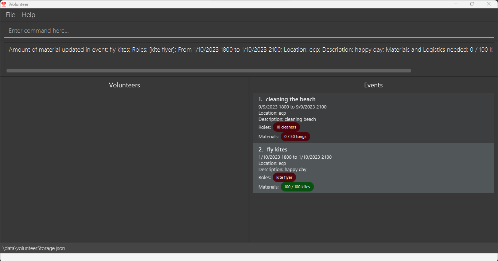
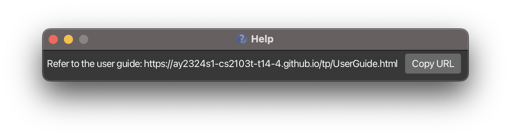
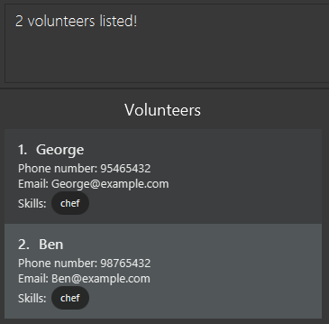
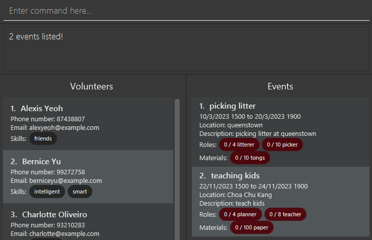
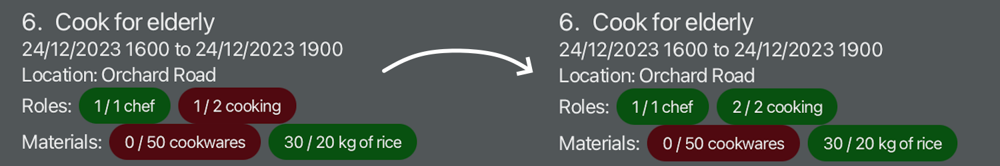
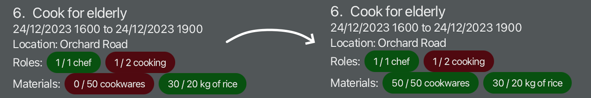

# iVolunteer User Guide

iVolunteer is your dedicated application for volunteer coordination, designed with **volunteer coordinators** in mind. If you're looking to enhance your volunteer coordination tasks, iVolunteer is the tool that empowers you to **manage volunteers and volunteering events efficiently**. iVolunteer streamlines the process for **swift and effective coordination**, by combining the efficiency of a **Command Line Interface (CLI)** with the advantages of a **Graphical User Interface (GUI)**.

**Command Line Interface (CLI):** a text-based interface that is used to operate software and operating systems while allowing the user to respond to visual prompts by typing single commands into the interface and receiving a reply in the same way.

**Graphical User Interface (GUI):** a form of user interface that allows users to interact with electronic devices through graphical icons and audio indicators such as primary notation.

<!-- * Table of Contents -->
<page-nav-print />

--------------------------------------------------------------------------------------------------------------------

## Quick start

1. Ensure you have [Java 11](https://www.oracle.com/java/technologies/javase/jdk11-archive-downloads.html) or above installed in your Computer.

1. Download the latest `iVolunteer.jar` from [here](https://github.com/AY2324S1-CS2103T-T14-4/tp/releases).

1. Copy the file to the folder you want to use as the _home folder_ for iVolunteer.

1. Open a command terminal, `cd` into the folder you put the jar file in, and use the `java -jar iVolunteer.jar` command to run the application. 
   A GUI similar to the below should appear in a few seconds. Note how the app contains some sample data. 

   

1. Type the command in the command box and press Enter to execute it. e.g. typing **`help`** and pressing Enter will open the help window. 

   Some example commands you can try:

   * `elist`
     * Lists all events

   * `ecreate n/food donation r/10 chef r/20 packer sd/23/9/2023 1500 l/hougang dsc/help food distribution m/50 potatoes b/50.00`
     * Creates an event with name `food donation`, roles needed `10 chef` and `20 packer`, event date `23rd September 2023, 3pm`, location `hougang`, description `help food distribution`, materials needed `50 potatoes` and budget `$50`

   * `edelete 3`
     * Deletes the 3rd event in the current event list

   * `vlist`
     * Lists all volunteers.

   * `vcreate n/John Doe p/98765432 e/johnd@example.com`
     * Adds a volunteer named `John Doe` to the list of volunteers.

   * `vdelete 3`
     * Deletes the 3rd volunteer in the current volunteer list.

   * `exit`
     * Exits the app.

1. Refer to the [Features](#features) below for details of each command.

--------------------------------------------------------------------------------------------------------------------

## Features

<box type="info" seamless>

**Notes about the command format:** 

* Words in `UPPER_CASE` are the parameters to be supplied by the user. 
  e.g. in `vfind n/NAME`, `NAME` is a parameter which can be used as `vfind n/John Doe`.

* Items in square brackets are optional. 
  e.g `n/NAME [s/SKILL]` can be used as `n/John Doe s/friendly` or as `n/John Doe`.

* Items with `…`​ after them can be used multiple times including zero times. 
  e.g. `[s/SKILL]…​` can be used as ` ` (i.e. 0 times), `s/friendly`, `s/friendly s/caring` etc.

* Parameters can be in any order. 
  e.g. if the command specifies `n/NAME p/PHONE_NUMBER`, `p/PHONE_NUMBER n/NAME` is also acceptable.

* Extraneous parameters for commands that do not take in parameters (such as `vlist`, `elist`, and `exit`) will be ignored. 
  e.g. if the command specifies `help 123`, it will be interpreted as `help`.

* If you are using a PDF version of this document, be careful when copying and pasting commands that span multiple lines as space characters surrounding line-breaks may be omitted when copied over to the application.
</box>

### Viewing help: `help`

Shows a message explaining how to access the help page.

Format: `help`

### Creating a new volunteer profile: `vcreate`

Volunteer coordinators can create new volunteer profiles, and add the volunteer into the volunteer list.

Format: `vcreate n/NAME p/PHONE_NUMBER e/EMAIL [s/SKILLS]…`

Parameters:
* n/ - Volunteer name
* p/ - Phone number of the volunteer
* e/ - Email address of the volunteer
* s/ - Skills a volunteer may have

<box type="tip" seamless>

**Tip:** A volunteer can have any number of skills (including 0).
</box>

Restrictions:
* The name is case-sensitive (`John` and `john` are considered different volunteers)
* The email must be in a valid format.
* The phone number must be a 8-digit number.
* The skills are case-sensitive (`chef` and `Chef` are considered different skills).
* Duplicate volunteers cannot be added to the volunteer list (case-sensitive).
  * A volunteer is considered duplicate if: his name already exists in the volunteer list.
  * Volunteers with the same phone number or email address are not considered as duplicates.

Examples:
* `vcreate n/John p/91234567 e/john123@gmail.com`
  * creates a volunteer named `John` with a phone number of `91234567` and an email address of `john123@gmail.com`, with no specific skills. The volunteer profile will be appended to the bottom of the volunteer list.
* `vcreate n/Mary p/92345678 e/mary123@gmail.com s/Cooking s/Carrying heavy goods`
  * creates a volunteer named `Mary` with a phone number of `92345678` and an email address of `mary123@gmail.com`, with two skills: `Cooking` and `Carrying heavy goods`. The volunteer profile will be appended to the bottom of the volunteer list.

### Listing all volunteers: `vlist`

Shows a list of all volunteers in the volunteer list.

Format: `vlist`

### Locating volunteers by name and skill: `vfind`

Finds volunteers whose name or skills contain any of the given keywords.

Format: `vfind [n/NAME]…​ [s/SKILL]…​`

Parameters:
* n/ - Volunteer name
* s/ - Skills of volunteer

<box type="tip" seamless>

**Tip:** Users can search for both the volunteer name and corresponding skills in a single command.
</box>

Restrictions:
* At least one of the optional fields must be provided.
* The search is case-insensitive. e.g `n/hans` will match `Hans`.
* Allows partial matching of keywords e.g. `n/Han` will match `Hans`.
* Both the volunteer name and corresponding skills can be searched.
* The order of the keywords does not matter. e.g. `s/chef n/Hans` and `n/Hans s/chef` are valid inputs.

Examples:
* `vfind n/David` (user searches for **one** name)
  * returns `David Li` and `David Tan`. (volunteers who have that NAME keyword will be returned)
* `vfind n/alex n/roy` (user searches for **more than one** name)
  * returns `Alexis Yeoh` and `Roy Balakrishnan`. (volunteers who have **at least one** of the NAME keywords will be returned, i.e. `OR` search)
* `vfind s/chef` (user searches for **one** skill)
  * returns `George` and `Ben`. (volunteers who have that SKILL keyword will be returned)
  

* `vfind s/intelligent s/smart` (user searches for **more than one** skill)
  * returns `Bernice Yu`. (volunteers who have **both** SKILL keywords will be returned, i.e. `AND` search)
* `vfind n/charlotte s/mechanic` (user searches for **one** name and **one** skill)
  * returns `Charlotte Oliveiro`. (volunteers who have **both** NAME and SKILL keyword will be returned, i.e. `AND` search)

### Editing a volunteer profile: `vedit`

Edits an existing volunteer in the volunteer list.

Format: `vedit VOLUNTEER_INDEX [n/NAME] [p/PHONE] [e/EMAIL] [s/SKILL]…​`

Parameters:
* n/ - Volunteer name
* p/ - Volunteer phone number
* e/ - Volunteer email
* s/ - Volunteer skill

Restrictions:
* Edits the volunteer at the specified `VOLUNTEER_INDEX`.
* `VOLUNTEER_INDEX` must be an integer corresponding to a volunteer in the currently displayed volunteer list: If the list of volunteers displayed is 10 volunteers long, the acceptable values will be from 1-10.
* At least one of the optional fields must be provided.
* Existing values will be updated to the input values.
* When editing skills, the existing skills of the volunteer will be removed i.e adding of skills is not cumulative.

<box type="tip" seamless>

**Tip:** You can remove all the volunteer’s skills by typing `s/` without
specifying any skills after it.
</box>

Examples:
* `vedit 1 p/91234567 e/johndoe@example.com`
  * Edits the phone number and email address of the 1st volunteer to be `91234567` and `johndoe@example.com` respectively.
* `vedit 2 n/Betsy Crower s/`
  * Edits the name of the 2nd volunteer to be `Betsy Crower` and clears all existing skills.

### Deleting a volunteer profile: `vdelete`

Volunteer coordinators can delete volunteers and remove them from the volunteer list if they no longer wish to volunteer anymore.

Format: `vdelete VOLUNTEER_INDEX`

Restrictions:

* Deletes the volunteer at the specified `VOLUNTEER_INDEX`.
* The `VOLUNTEER_INDEX` refers to the index number shown in the displayed volunteer list.
* `VOLUNTEER_INDEX` must be an integer corresponding to a volunteer in the currently displayed volunteer list: If the list of volunteers displayed is 10 volunteers long, the acceptable values will be from 1-10.

Examples:
* `vlist`, followed by `vdelete 6` will remove the 6th volunteer displayed in the volunteer list.
* `vfind n/Betsy` followed by `vdelete 1` deletes the 1st volunteer in the results of the `vfind` command.

### Creating an event: `ecreate`

Volunteer coordinators can create new events.

Format: `ecreate n/EVENT_NAME r/ROLES_NEEDED… sd/START_DATETIME [ed/END_DATETIME] l/LOCATION dsc/DESCRIPTION [m/MATERIALS_NEEDED]... [b/BUDGET] [vs/MAX_VOLUNTEER_COUNT]`

Parameters:
* n/ - Event name
* r/ - Roles needed for the event and its quantity, in the format `[required quantity] [role name]` (e.g. `30 farmer`)
* sd/ - Start date and time of the event
* ed/ - End date and time of the event
* l/ - Location of the event
* dsc/ - Description of the event
* m/ - Materials needed for the event and its quantity, in the format `[required quantity] [material name]` (e.g. `30 potatoes`)
* b/ - Budget for the event
* vs/ - Maximum number of volunteers allowed in the event

Restrictions:
* All parameters must be separated by a single space.
* All arguments cannot be blank.
* The date and time formats must be exactly `DD/MM/YYYY TTTT`.
* If the end date and time is specified, it must be the _same time_ or _after_ the start date and time of the event.
* The material argument must be a non-negative integer, followed by a space, and then the name of the material required.
  * **Example of valid materials:** `m/30 potato`, `m/0 apples`
* The role argument must be a non-negative integer, followed by a space, and then the name of the role required.
  * **Example of valid roles:** `r/20 teachers`, `r/0 farmer`
* If there are any duplicated materials or roles, only the first duplicated material or role will show up.
  * Duplicated materials are materials with the same material name and quantity. As a result, `m/23 potatoes` and `m/50 potatoes` are not duplicates.
  * Duplicated roles are materials with the same role name and quantity. For example, `r/23 farmers` and `r/50 farmers` are not duplicates.
  * Take note that duplicated materials and roles are case-sensitive: `m/23 Potatoes` and `m/23 potatoes` are not duplicates.
  * To remove duplicates, you can use the [`eedit` command](#edit-the-details-of-an-event-eedit) and re-build the entire role or material list. Examples: `eedit EVENT_INDEX r/23 farmers r/50 cleaners` or `eedit EVENT_INDEX m/23 potatoes m/3 fields`.
* The budget argument must be a number in 2 decimal places.
* The maximum number of volunteers argument must be a non-negative integer.

<box type="tip" seamless>

**Tips:** 
- If the end date and time is not specified, iVolunteer will automatically set the end date and time to **exactly 3 hours** after the start date and time.
- If the maximum number of volunteers argument is not specified, iVolunteer will not set a limit to the number of volunteers within the event.
  - Alternatively, if the maximum number of volunteers is set to 0 (e.g. `ecreate ... vs/0`), iVolunteer will remove a limit to the number of volunteer within the event.
- Roles needed can be fulfilled by adding the volunteer of that specific skill into the event. Refer to the [FAQ](#faq) for more information.
- Materials needed can be fulfilled using the `eaddm` command. Refer to the [FAQ](#faq) for more information.
</box>

Examples:
* `ecreate n/clean beach r/10 cleaner sd/30/11/2023 1200 ed/30/11/2023 1800 l/east coast park dsc/help clean east coast park m/10 pairs of gloves m/10 trash bags b/50.00`
  * Creates an event with name `clean beach`, roles needed `10 cleaner`, event date from `30th November 2023, 12pm` to `30th November 2023, 6pm`, location `east coast park`, description `help clean east coast park`, materials needed `10 pairs of gloves` and `10 trash bags` and budget `$50.00`

### Listing all events: `elist`
Volunteer coordinators can view all the events they are organising.

For each event, only the most important information will be shown: name, start date and time, end date and time, location, roles needed and materials needed.

Format: `elist`

<box type="tip" seamless>

**Tip:** Events are sorted automatically in chronological order!
</box>

### Locating events by name: `efind`

Finds events whose name contain any of the given keywords.

Format: `efind n/NAME…​`

* At least one NAME keyword must be provided.
* The search is case-insensitive. e.g `n/fixING comPUTErs` will match `fixing computers`.
* Allows partial matching of keywords e.g. `n/fix` will match `fixing computers`.
* Events matching **at least one** NAME keyword will be returned (i.e. `OR` search).

Examples:
* `efind n/food` returns `food donaton` and `cooking food`
* `efind n/litter n/teaching` returns `picking litter` and `teaching kids` 

### Reading an individual event: `eshow`
Volunteer coordinators can read up more about an individual event, to familiarize themselves with its requirements while planning for it.

Information shown: event name, start date and time, end date and time, location, roles needed, description, budget (if any), materials needed (if any), and maximum number of volunteers limit (if any).

Format: `eshow EVENT_INDEX`

<box type="tip" seamless>

**Tip 1:** `eshow` does not display the volunteers assigned to the event. To do so, use the [elistv](#listing-all-volunteers-in-an-event--elistv) command instead.
</box>

<box type="tip" seamless>

**Tip 2:** Pressing the `ESC` key closes the pop-up window!
</box>

Restrictions:
* First part must be `eshow`
* Second part must be an integer that represents a valid `EVENT_INDEX`: If the list of events displayed is 10 events long, the acceptable values will be from 1-10.
* First and second parts must be separated by a single space.

Examples:
* `eshow 7`
  * Creates a pop-up window containing all details of the event at index `7`.

### Deleting an event: `edelete`

Deletes the event from the event list.

Format: `edelete EVENT_INDEX`

Restrictions:
* Deletes the event at the specified `EVENT_INDEX`.
* `EVENT_INDEX` must be an integer corresponding to an event in the currently displayed event list: If the list of events displayed is 10 events long, the acceptable values will be from 1-10.

Examples:
* `elist` followed by `edelete 2` deletes the 2nd event in the event list.
* `efind n/Beach cleaning` followed by `edelete 1` deletes the 1st event in the results of the `efind` command
* `efind Beach cleaning` followed by `edelete 1` deletes the 1st event in the results of the `find` command (tentative feature)

### Edit the details of an event: `eedit`

Volunteer coordinators can edit the details of their events.

Format: `eedit EVENT_INDEX [r/NUMBER_OF_ROLES ROLES_NEEDED]... [sd/START_DATETIME] [ed/END_DATETIME] [l/LOCATION] [dsc/DESCRIPTION] [m/NUMBER_OF_MATERIALS MATERIALS_NEEDED]... [b/BUDGET] [vs/MAX_VOLUNTEER_COUNT]`

Parameters:
* r/ - Roles needed for the event and its quantity
* sd/ - Start date and time of the event
* ed/ - End date and time of the event
* l/ - Location of the event
* dsc/ - Description of the event
* m/ - Materials needed for the event and its quantity
* b/ - Budget for the event
* vs/ - Maximum number of volunteers in the event

Restrictions:
* All parameters must be separated by a single space.
* `EVENT_INDEX` must be an integer corresponding to an event in the currently displayed event list: If the list of events displayed is 10 events long, the acceptable values will be from 1-10.
* The event name and assigned volunteers cannot be edited.
* The date and time formats must be exactly `DD/MM/YYYY TTTT`.
* If the end date and time is specified, it must be the _same time_ or _after_ the start date and time of the event.
* If the start date and time is specified, it must be the _same time_ or _before_ the end date and time of the event.
* The material argument must be a positive integer, followed by a space, and then the name of material required.
* If there is nothing follow by the role prefix in the input, the roles of the event will be overwritten and reset to empty.
* The role argument must be a positive integer, followed by a space, and then the name of role required.
* If there is nothing follow by the material prefix in the input, the materials of the event will be overwritten and reset to empty.
* The budget argument must be a number in 2 decimal places.

**Tips:** 
* At least 1 optional fields must be provided.
* The assigned volunteers cannot be edited with eedit, to do so, refer to [eaddv](#adding-a-volunteer-into-an-event-eaddv) and [eremovev](#removing-a-volunteer-from-an-event-eremovev) for more detail information.

Examples:
* `eedit 1 n/clean beach r/10 cleaner sd/30/11/2023 1200 l/east coast park dsc/help clean east coast park m/ `
    * Edits the event to name `clean beach`, roles needed `10 cleaner`, event date from `30th November 2023, 12pm`, location `east coast park`, description `help clean east coast park` and materials needed to empty.

### Clearing all event entries: `eclear`

Clears all entries from the event list.

Format: `eclear`

### Adding and tracking quantity of materials into an event: `eaddm`

Volunteer coordinators can track the current quantity of materials in an event and add materials into an event, in order to
track the progress of the logistics gathered for the event.

Format: `eaddm eid/EVENT_INDEX m/MATERIAL`

Parameters:
* eid/ - Event index in the displayed event list
* m/ - The current quantity of a material to add to the event

Restrictions:
* `EVENT_INDEX` must be an integer corresponding to an event in the currently displayed event list: If the list of events displayed is 10 events long, the acceptable values will be from 1-10.
* The material name specified must be present within the event.

Examples:
* `ecreate n/clean beach m/10 trash bags ...` (refer to [ecreate](#creating-an-event-ecreate) above for full command) creates an 
  event `clean beach` that requires `20 trash bags`. By performing `efind n/clean beach`, then `eaddm eid/1 m/10 trash bags`,
  the event `clean beach` will now contain `10 / 20 trash bags`.

### Adding a volunteer into an event: `eaddv`

Adds a volunteer to an event.

Format: `eaddv vid/VOLUNTEER_INDEX eid/EVENT_INDEX`

Parameters:
* vid/ - Volunteer index in the displayed volunteer list
* eid/ - Event index in the displayed event list

Restrictions:
* `EVENT_INDEX` must be an integer corresponding to an event in the currently displayed event list: If the list of events displayed is 10 events long, the acceptable values will be from 1-10.
* `VOLUNTEER_INDEX` must be an integer corresponding to a volunteer in the currently displayed volunteer list: If the list of volunteers displayed is 10 volunteers long, the acceptable values will be from 1-10.
* The volunteer must not already be added to the event.
* The number of volunteers in the event should be less than the maximum number of volunteers allowed for the event, else adding a new volunteer
  would result in the number of volunteers exceeding the maximum allowed. 
  * **Tip:** To change the limit on the maximum number of volunteers for a certain event, use the
    [`eedit` command](#edit-the-details-of-an-event-eedit).

Examples:
* `eaddv vid/1 eid/1`
  * Adds the volunteer at index 1 of the displayed volunteer list to the event at index 1 of the displayed event list.

### Listing all volunteers in an event: `elistv`

Shows a list of all volunteers in an event.

Format: `elistv EVENT_INDEX`

Restrictions:
* `EVENT_INDEX` must be an integer corresponding to an event in the currently displayed event list: If the list of events displayed is 10 events long, the acceptable values will be from 1-10.

Examples:
* `elistv 1`
  * Lists the volunteers added to the event at index 1 of the displayed event list.

### Listing all events joined by a volunteer: `vliste`

Shows a list of all events joined by a volunteer.

Format: `vliste VOLUNTEER_INDEX`

Restrictions:
* `VOLUNTEER_INDEX` must be an integer corresponding to a volunteer in the currently displayed volunteer list: If the list of volunteers displayed is 10 volunteers long, the acceptable values will be from 1-10.

Examples:
* `vliste 1`
    * Lists all events participated by the volunteer at index 1 of the displayed volunteer list.

### Removing a volunteer from an event: `eremovev`

Removes a volunteer from an event.

Format: `eremovev vid/VOLUNTEER_INDEX eid/EVENT_INDEX`

Parameters:
* vid/ - Volunteer index in displayed volunteer list
* eid/ - Event index in displayed event list

Restrictions:
* `EVENT_INDEX` must be an integer corresponding to an event in the currently displayed event list: If the list of events displayed is 10 events long, the acceptable values will be from 1-10.
* `VOLUNTEER_INDEX` must be an integer corresponding to a volunteer in the currently displayed volunteer list: If the list of volunteers displayed is 10 volunteers long, the acceptable values will be from 1-10.
* The volunteer should already be added to the event.

Examples:
* `eremovev vid/1 eid/1`
  * Removes the volunteer at index 1 of the displayed volunteer list from the event at index 1 of the displayed event list.

### Undo a Command: `undo`

Undoes an undo-able command.

Format: `undo`

Restrictions:
* Undo-able commands include:
  * vcreate
  * vdelete
  * vedit
  * vclear
  * ecreate
  * edelete
  * eedit
  * eaddv
  * eremovev
  * eaddm
* Only commands that changed the current history stack can be undone (iVolunteer does not remember commands that were executed in the previous run of the app).

### Redo a Command: `redo`

Redoes the undo command. 

Format: `redo`

Restrictions:
* Can only be executed after an undo command.
* This command can be thought of as an 'undo' exclusively for the `undo` command.

### Exiting the program : `exit`

Exits the program.

Format: `exit`

### Saving the data

iVolunteer data is automatically saved in the hard disk after any command is executed. There is no need to manually save your data.

### Editing the data file

iVolunteer data is saved automatically as two JSON files, `[JAR file location]/data/volunteerStorage.json` (volunteer storage) and `[JAR file location]/data/eventStorage.json` (event storage and _event-volunteer interactions_). Advanced users are welcome to update data directly by editing both data files.

<box type="warning" seamless>

**Caution:**
If your changes to any data file makes its format invalid, iVolunteer will discard all data and start with an empty data file at the next run.  Hence, it is recommended to take a backup of the file before editing it.
</box>

### Archiving data files `[coming in v2.0]`

_Details coming soon ..._

--------------------------------------------------------------------------------------------------------------------

## FAQ

**Q**: As a Windows 11 user, how do I open a command terminal? 
**A**: On your Windows 11 computer, do the following:
1. Select the Start Menu (the Windows icon) in the taskbar, or press the Windows key.
2. Type `cmd` in the search bar.
3. Select Command Prompt from the list.

**Q**: As a Mac user, how do I open a command terminal? 
**A**: On your Mac, do one of the following:
1. Click the Launchpad icon in the Dock, type Terminal in the search field, then click Terminal.
2. In the Finder, open the `/Applications/Utilities` folder, then double-click Terminal.

**Q**: How do I fill up the *role* information within the UI?  
  

**A**: To add a **volunteer** with a certain role, you can use the [`eaddv` command](#adding-a-volunteer-into-an-event-eaddv) as follows:
1. Ensure that the volunteer's skill matches the role of the event you want to fill up (both role and skills are case-sensitive).
   * In the example image above, volunteers with skills `chef` or `cooking` can be added. If not, you can use the [`eedit` command](#edit-the-details-of-an-event-eedit) (e.g. `eedit VOLUNTEER_INDEX s/cooking s/other_skill`) to change the volunteer's skills to match the role.
2. Use the `eaddv eid/EVENT_INDEX vid/VOLUNTEER_INDEX` command to add the volunteer to the event. For example, if the volunteer with skill `cooking` you want to add is in index `3` of the displayed volunteer list, and the event with role `cooking` required is in index `4` of the displayed event list, then you can use `eaddv vid/3 eid/4` to add that volunteer into the event.
3. You should notice that the `cooking` role would be **incremented by 1** in the UI. In the example above, since `1 / 2 cooking` skills has been filled up, the addition of the new volunteer will cause the role `cooking` to be updated to `2 / 2 cooking`. The role will also turn green since there are already 2 volunteers with role `cooking`.

**Q**: How do I fill up the *material* information within the UI?  
  
**A**: To add **materials** to the event, you can use the [`eaddm` command](#adding-and-tracking-quantity-of-materials-into-an-event-eaddm) as follows:
1. Find the event to add materials in within the displayed volunteer list. You can use the `elist` command to list all events.
2. Take note of the event index and add the appropriate amount of materials to the event. For example, if the event is in index `4` within the displayed event list and since there are `0 / 50 cookwares` in this event, you can run the command `eaddm eid/4 m/50 cookwares` to update the current amount of materials within the event.
3. You should notice that the `cookwares` material would be **incremented by the amount specified** in the `eaddm` command within the UI. In the example above, the `eaddm` command would update the material to `50 / 50 cookwares`. The material would also turn green in the UI to indicate that you have fulfilled the material requirement for the event.

--------------------------------------------------------------------------------------------------------------------

## Known issues

coming soon

--------------------------------------------------------------------------------------------------------------------

## Command summary

| Action                                        | Format, Examples                                                                                                                                                                                                                                                                                                                           |
|-----------------------------------------------|--------------------------------------------------------------------------------------------------------------------------------------------------------------------------------------------------------------------------------------------------------------------------------------------------------------------------------------------|
| **Display help window**                       | `help`                                                                                                                                                                                                                                                                                                                                     |
| **Create a new event**                        | `ecreate n/EVENT_NAME r/ROLES_NEEDED… sd/START_DATETIME [ed/END_DATETIME] l/LOCATION dsc/DESCRIPTION [m/MATERIALS_AND_LOGISTICS_NEEDED]... [b/BUDGET]`   e.g., `ecreate n/clean beach r/10 cleaner sd/30/11/2023 1200 ed/30/11/2023 1800 l/east coast park dsc/help clean east coast park m/10 pairs of gloves m/10 trash bags b/50.00` |
| **List all events**                           | `elist`                                                                                                                                                                                                                                                                                                                                    |
| **Read an individual event**                  | `eshow EVENT_INDEX`   e.g., `eshow 8`                                                                                                                                                                                                                                                                                                   |
| **Edit an individual event**                  | `eedit EVENT_INDEX [r/NUMBER_OF_ROLES ROLES_NEEDED]... [sd/START_DATETIME] [ed/END_DATETIME] [l/LOCATION] [dsc/DESCRIPTION] [m/NUMBER_OF_MATERIALS_AND_LOGISTICS MATERIALS_AND_LOGISTICS_NEEDED]... [b/BUDGET] [vs/MAX_VOLUNTEER_COUNT]`   e.g, `eedit 1 r/10 farmer ed/20/11/2024 1300 l/malaysia vs/3`                                |
| **Delete an event**                           | `edelete EVENT_INDEX`   e.g., `edelete 3`                                                                                                                                                                                                                                                                                               |
| **Add a quantity of materials to an event**   | `eaddm eid/EVENT_INDEX m/MATERIALS_AND_LOGISTICS_NEEDED`  e.g., `eaddm eid/1 m/10 potato`                                                                                                                                                                                                                                               |
| **Create a new volunteer profile**            | `vcreate n/VOLUNTEER_NAME p/PHONE_NUMBER e/EMAIL [s/SKILLS]...`  e.g.,`vcreate n/John Lim p/81234567 e/john123@gmail.com s/Cooking`                                                                                                                                                                                                     |
| **List all volunteer profiles**               | `vlist`                                                                                                                                                                                                                                                                                                                                    |
| **Edit a volunteer profile**                  | `vedit VOLUNTEER_INDEX [n/NAME] [p/PHONE] [e/EMAIL] [s/SKILL]…​`   e.g., `vedit 1 p/91234567 e/johndoe@example.com`                                                                                                                                                                                                                     |
| **Delete a volunteer profile**                | `vdelete VOLUNTEER_INDEX`   e.g., `vdelete 4`                                                                                                                                                                                                                                                                                           |
| **Add a volunteer to an event**               | `eaddv vid/VOLUNTEER_INDEX eid/EVENT_INDEX`  e.g., `eaddv vid/1 eid/3`                                                                                                                                                                                                                                                                  |
| **Check for volunteers assigned to an event** | `elistv EVENT_INDEX`   e.g. `elistv 8`                                                                                                                                                                                                                                                                                                  |
| **Check for events joined by a volunteer**    | `vliste VOLUNTEER_INDEX`   e.g. `vliste 3`                                                                                                                                                                                                                                                                                              |
| **Remove a volunteer from an event**          | `eremovev vid/VOLUNTEER_INDEX eid/EVENT_INDEX`  e.g., `eremovev vid/3 eid/4`                                                                                                                                                                                                                                                            |
| **Exits iVolunteer**                          | `exit`                                                                                                                                                                                                                                                                                                                                     |

 
